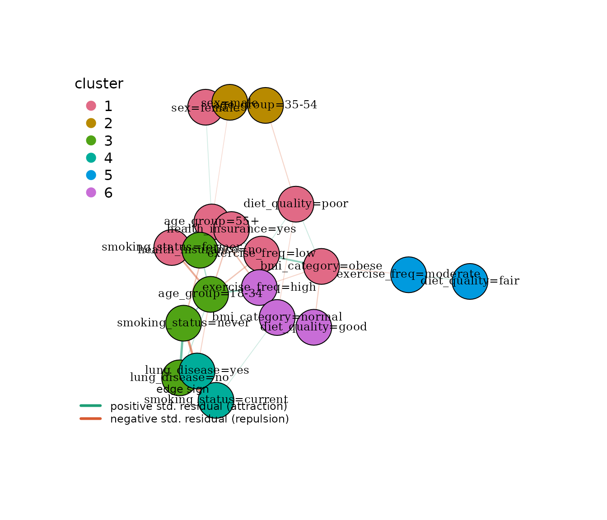
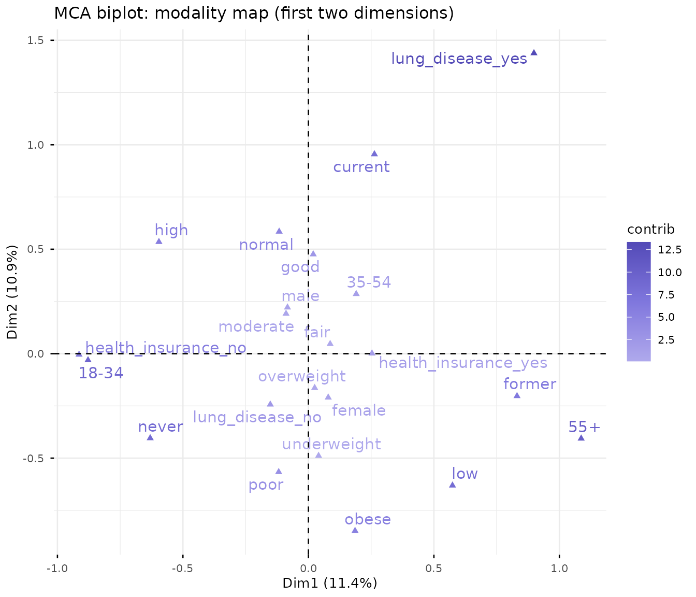
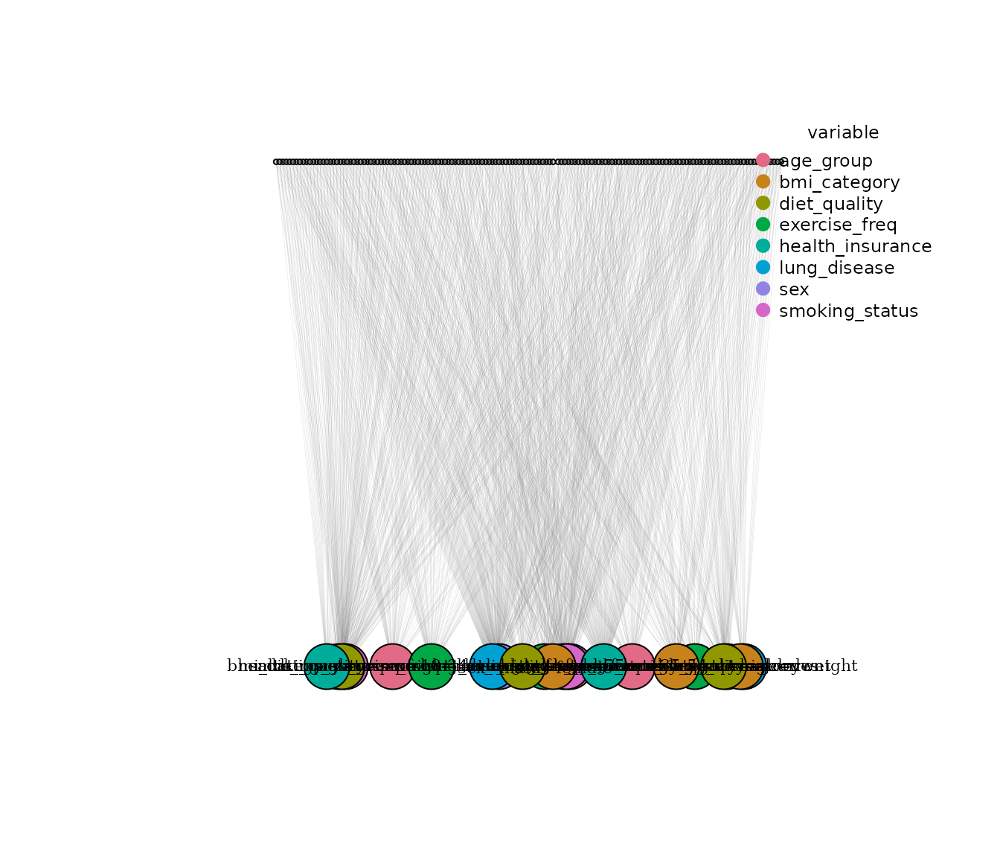
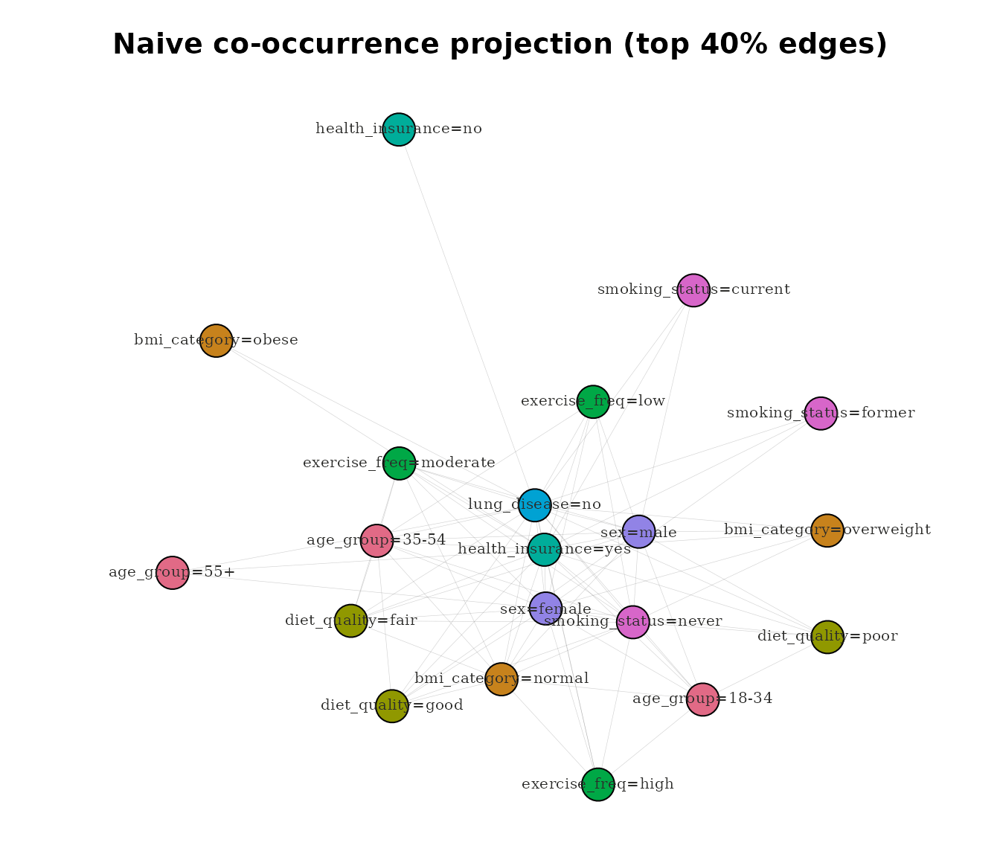

# Comparing catgraph modality networks with MCA and bipartite approaches

### Why this vignette

`catgraph`’s modality layer is one of several established traditions for
analysing the structure of categorical data. This vignette runs the
modality-level workflow on the bundled `survey_health` dataset alongside
three alternative methods, so readers can see directly what each method
says — and, crucially, where `catgraph` adds information and where it
should **not** be overclaimed. A final section introduces
[`joint_balance()`](https://atinakosta.github.io/catgraph/reference/joint_balance.md),
the high-level cross-group diagnostic shipped in v0.8.0.

The methods compared:

1.  **`catgraph` modality network** — chi-square / phi-filtered
    co-association graph on modalities. Scope: which category levels
    significantly co-associate across variables.
2.  **Multiple Correspondence Analysis (MCA)** — geometric approach.
    Scope: low-dimensional embedding of modalities in a continuous space
    based on chi-square distances between row and column profiles.
3.  **Bipartite respondent–modality network** — two-mode incidence
    graph. Scope: the raw unprojected endorsement structure, before any
    statistical filter.
4.  **Naive co-occurrence projection** — the bipartite graph projected
    onto its modality partition, with edges weighted by raw count of
    shared respondents. Scope: which modality pairs are most frequently
    endorsed together, without adjustment for base rates.

All four are descriptive methods. None is a substitute for the others;
each answers a different question about the same categorical data.

### Setup

``` r

library(catgraph)
library(igraph)

data(survey_health)
str(survey_health)
#> 'data.frame':    600 obs. of  8 variables:
#>  $ sex             : Factor w/ 2 levels "female","male": 2 1 2 2 1 2 1 1 2 1 ...
#>  $ age_group       : Factor w/ 3 levels "18-34","35-54",..: 3 3 2 1 2 1 3 2 3 3 ...
#>  $ smoking_status  : Factor w/ 3 levels "never","former",..: 2 2 3 3 2 3 1 2 1 3 ...
#>  $ lung_disease    : Factor w/ 2 levels "no","yes": NA 2 1 1 1 1 1 1 1 1 ...
#>  $ exercise_freq   : Factor w/ 3 levels "low","moderate",..: 1 2 2 1 2 2 1 1 2 2 ...
#>  $ bmi_category    : Factor w/ 4 levels "underweight",..: NA 2 3 3 2 3 4 4 3 2 ...
#>  $ diet_quality    : Factor w/ 3 levels "poor","fair",..: 2 2 NA 1 3 3 3 3 1 1 ...
#>  $ health_insurance: Factor w/ 2 levels "no","yes": 2 1 2 2 1 1 2 2 2 2 ...
```

`survey_health` is a synthetic dataset with 600 respondents, eight
categorical variables, and known designed-in association structure. See
[`?survey_health`](https://atinakosta.github.io/catgraph/reference/survey_health.md)
for details.

### Method 1 — catgraph modality network

``` r

mg <- build_modality_graph(survey_health)
mg <- prune_modality_edges(mg, min_weight = 0.10, max_p = 0.05)
set.seed(1)
mg <- cluster_modalities(mg, method = "louvain")

mg
#> $graph
#> IGRAPH 62c37db UNW- 22 38 -- 
#> + attr: name (v/c), variable (v/c), modality (v/c), cluster (v/n),
#> | weight (e/n), phi_signed (e/n), p_value (e/n), std_resid (e/n)
#> + edges from 62c37db (vertex names):
#>  [1] sex=female            --age_group=35-54      
#>  [2] sex=male              --age_group=35-54      
#>  [3] sex=female            --age_group=55+        
#>  [4] sex=male              --age_group=55+        
#>  [5] age_group=18-34       --smoking_status=never 
#>  [6] age_group=55+         --smoking_status=never 
#>  [7] age_group=18-34       --smoking_status=former
#> + ... omitted several edges
#> 
#> $modalities
#>                        node         variable    modality
#> 1                sex=female              sex      female
#> 2                  sex=male              sex        male
#> 3           age_group=18-34        age_group       18-34
#> 4           age_group=35-54        age_group       35-54
#> 5             age_group=55+        age_group         55+
#> 6      smoking_status=never   smoking_status       never
#> 7     smoking_status=former   smoking_status      former
#> 8    smoking_status=current   smoking_status     current
#> 9           lung_disease=no     lung_disease          no
#> 10         lung_disease=yes     lung_disease         yes
#> 11        exercise_freq=low    exercise_freq         low
#> 12   exercise_freq=moderate    exercise_freq    moderate
#> 13       exercise_freq=high    exercise_freq        high
#> 14 bmi_category=underweight     bmi_category underweight
#> 15      bmi_category=normal     bmi_category      normal
#> 16  bmi_category=overweight     bmi_category  overweight
#> 17       bmi_category=obese     bmi_category       obese
#> 18        diet_quality=poor     diet_quality        poor
#> 19        diet_quality=fair     diet_quality        fair
#> 20        diet_quality=good     diet_quality        good
#> 21      health_insurance=no health_insurance          no
#> 22     health_insurance=yes health_insurance         yes
#> 
#> $indicator_matrix
#>        sex=female sex=male age_group=18-34 age_group=35-54 age_group=55+
#>   [1,]          1        0               0               0             1
#>   [2,]          0        1               1               0             0
#>   [3,]          1        0               0               1             0
#>   [4,]          0        1               1               0             0
#>   [5,]          1        0               0               0             1
#>   [6,]          1        0               0               1             0
#>   [7,]          0        1               0               0             1
#>   [8,]          1        0               0               0             1
#>   [9,]          0        1               1               0             0
#>  [10,]          1        0               1               0             0
#>  [11,]          1        0               0               0             1
#>  [12,]          0        1               0               0             1
#>  [13,]          1        0               1               0             0
#>  [14,]          0        1               0               1             0
#>  [15,]          1        0               0               0             1
#>  [16,]          1        0               1               0             0
#>  [17,]          0        1               0               1             0
#>  [18,]          0        1               0               1             0
#>  [19,]          0        1               0               1             0
#>  [20,]          1        0               0               0             1
#>  [21,]          0        1               0               1             0
#>  [22,]          0        1               0               0             1
#>  [23,]          1        0               0               0             1
#>  [24,]          1        0               1               0             0
#>  [25,]          1        0               0               1             0
#>  [26,]          1        0               1               0             0
#>  [27,]          0        1               0               1             0
#>  [28,]          0        1               1               0             0
#>  [29,]          0        1               0               0             1
#>  [30,]          0        1               1               0             0
#>  [31,]          1        0               0               1             0
#>  [32,]          0        1               0               1             0
#>  [33,]          0        1               0               1             0
#>  [34,]          0        1               1               0             0
#>  [35,]          1        0               1               0             0
#>  [36,]          0        1               1               0             0
#>  [37,]          1        0               0               1             0
#>  [38,]          1        0               0               1             0
#>  [39,]          0        1               0               0             1
#>  [40,]          0        1               1               0             0
#>  [41,]          1        0               1               0             0
#>  [42,]          0        1               0               1             0
#>  [43,]          1        0               0               1             0
#>  [44,]          1        0               1               0             0
#>  [45,]          0        1               0               0             1
#>  [46,]          0        1               0               0             1
#>  [47,]          1        0               0               1             0
#>  [48,]          1        0               0               1             0
#>  [49,]          1        0               0               0             1
#>  [50,]          1        0               1               0             0
#>  [51,]          1        0               0               1             0
#>  [52,]          0        1               1               0             0
#>  [53,]          1        0               0               0             1
#>  [54,]          0        1               0               1             0
#>  [55,]          0        1               0               1             0
#>  [56,]          0        1               1               0             0
#>  [57,]          1        0               0               0             1
#>  [58,]          1        0               0               1             0
#>  [59,]          0        1               0               1             0
#>  [60,]          0        1               0               0             1
#>  [61,]          0        1               0               1             0
#>  [62,]          1        0               1               0             0
#>  [63,]          1        0               1               0             0
#>  [64,]          1        0               0               0             1
#>  [65,]          1        0               1               0             0
#>  [66,]          0        1               1               0             0
#>  [67,]          1        0               1               0             0
#>  [68,]          0        1               1               0             0
#>  [69,]          1        0               0               1             0
#>  [70,]          1        0               0               0             1
#>  [71,]          0        1               0               1             0
#>  [72,]          0        1               0               0             1
#>  [73,]          0        1               0               1             0
#>  [74,]          0        1               0               1             0
#>  [75,]          1        0               1               0             0
#>  [76,]          0        1               1               0             0
#>  [77,]          1        0               0               1             0
#>  [78,]          0        1               0               1             0
#>  [79,]          0        1               0               0             1
#>  [80,]          1        0               0               1             0
#>  [81,]          0        1               1               0             0
#>  [82,]          1        0               0               0             1
#>  [83,]          0        1               0               1             0
#>  [84,]          1        0               0               1             0
#>  [85,]          1        0               1               0             0
#>  [86,]          1        0               0               0             1
#>  [87,]          0        1               0               0             1
#>  [88,]          1        0               0               1             0
#>  [89,]          1        0               0               1             0
#>  [90,]          1        0               1               0             0
#>  [91,]          1        0               0               1             0
#>  [92,]          1        0               0               0             1
#>  [93,]          0        1               0               1             0
#>  [94,]          0        1               1               0             0
#>  [95,]          0        1               1               0             0
#>  [96,]          1        0               0               1             0
#>  [97,]          1        0               0               1             0
#>  [98,]          1        0               1               0             0
#>  [99,]          1        0               0               0             1
#> [100,]          0        1               1               0             0
#> [101,]          0        1               0               1             0
#> [102,]          0        1               1               0             0
#> [103,]          1        0               0               1             0
#> [104,]          0        1               0               1             0
#> [105,]          0        1               1               0             0
#> [106,]          1        0               1               0             0
#> [107,]          1        0               1               0             0
#> [108,]          1        0               1               0             0
#> [109,]          1        0               0               1             0
#> [110,]          0        1               0               1             0
#> [111,]          1        0               1               0             0
#> [112,]          1        0               0               0             1
#> [113,]          1        0               1               0             0
#> [114,]          1        0               1               0             0
#> [115,]          0        1               0               0             1
#> [116,]          0        1               1               0             0
#> [117,]          0        1               0               0             1
#> [118,]          1        0               1               0             0
#> [119,]          0        1               1               0             0
#> [120,]          0        1               0               0             1
#> [121,]          0        1               1               0             0
#> [122,]          0        1               0               1             0
#> [123,]          1        0               0               0             1
#> [124,]          1        0               1               0             0
#> [125,]          1        0               1               0             0
#> [126,]          0        1               0               0             1
#> [127,]          0        1               0               0             1
#> [128,]          1        0               1               0             0
#> [129,]          1        0               0               0             1
#> [130,]          0        1               0               1             0
#> [131,]          1        0               0               0             1
#> [132,]          0        1               0               1             0
#> [133,]          0        1               0               1             0
#> [134,]          0        1               1               0             0
#> [135,]          0        1               0               0             1
#> [136,]          1        0               0               1             0
#> [137,]          1        0               1               0             0
#> [138,]          1        0               1               0             0
#> [139,]          1        0               0               1             0
#> [140,]          1        0               0               1             0
#> [141,]          1        0               1               0             0
#> [142,]          1        0               1               0             0
#> [143,]          1        0               0               1             0
#> [144,]          1        0               0               1             0
#> [145,]          0        1               1               0             0
#> [146,]          1        0               0               1             0
#> [147,]          0        1               1               0             0
#> [148,]          1        0               1               0             0
#> [149,]          0        1               0               1             0
#> [150,]          1        0               1               0             0
#> [151,]          1        0               0               0             1
#> [152,]          0        1               0               1             0
#> [153,]          0        1               0               1             0
#> [154,]          1        0               1               0             0
#> [155,]          1        0               1               0             0
#> [156,]          0        1               1               0             0
#> [157,]          1        0               1               0             0
#> [158,]          0        1               1               0             0
#> [159,]          1        0               0               0             1
#> [160,]          1        0               0               0             1
#> [161,]          1        0               0               1             0
#> [162,]          1        0               0               0             1
#> [163,]          0        1               0               1             0
#> [164,]          1        0               0               0             1
#> [165,]          1        0               0               1             0
#> [166,]          1        0               1               0             0
#> [167,]          1        0               1               0             0
#> [168,]          0        1               0               1             0
#> [169,]          1        0               0               1             0
#> [170,]          0        1               0               1             0
#> [171,]          1        0               0               1             0
#> [172,]          1        0               1               0             0
#> [173,]          0        1               1               0             0
#> [174,]          1        0               0               1             0
#> [175,]          1        0               0               1             0
#> [176,]          1        0               0               0             1
#> [177,]          1        0               0               0             1
#> [178,]          1        0               1               0             0
#> [179,]          0        1               0               1             0
#> [180,]          1        0               0               0             1
#> [181,]          0        1               1               0             0
#> [182,]          1        0               0               1             0
#> [183,]          1        0               0               0             1
#> [184,]          1        0               0               1             0
#> [185,]          1        0               0               1             0
#> [186,]          1        0               1               0             0
#> [187,]          1        0               0               0             1
#> [188,]          1        0               1               0             0
#> [189,]          1        0               0               0             1
#> [190,]          1        0               0               0             1
#> [191,]          0        1               0               0             1
#> [192,]          0        1               0               1             0
#> [193,]          0        1               1               0             0
#> [194,]          1        0               0               1             0
#> [195,]          1        0               1               0             0
#> [196,]          0        1               0               0             1
#> [197,]          0        1               0               1             0
#> [198,]          1        0               0               0             1
#> [199,]          1        0               0               0             1
#> [200,]          1        0               0               1             0
#> [201,]          1        0               0               1             0
#> [202,]          1        0               1               0             0
#> [203,]          0        1               0               1             0
#> [204,]          0        1               0               0             1
#> [205,]          0        1               1               0             0
#> [206,]          1        0               1               0             0
#> [207,]          0        1               0               1             0
#> [208,]          1        0               1               0             0
#> [209,]          0        1               0               1             0
#> [210,]          0        1               1               0             0
#> [211,]          0        1               0               0             1
#> [212,]          1        0               0               1             0
#> [213,]          0        1               1               0             0
#> [214,]          1        0               1               0             0
#> [215,]          1        0               0               1             0
#> [216,]          0        1               1               0             0
#> [217,]          0        1               1               0             0
#> [218,]          0        1               0               1             0
#> [219,]          1        0               1               0             0
#> [220,]          0        1               0               1             0
#> [221,]          1        0               0               0             1
#> [222,]          0        1               0               0             1
#> [223,]          1        0               0               0             1
#> [224,]          1        0               0               1             0
#> [225,]          0        1               1               0             0
#> [226,]          1        0               0               1             0
#> [227,]          1        0               0               0             1
#> [228,]          1        0               1               0             0
#> [229,]          1        0               0               1             0
#> [230,]          0        1               0               1             0
#> [231,]          0        1               0               0             1
#> [232,]          1        0               0               1             0
#> [233,]          0        1               0               0             1
#> [234,]          1        0               1               0             0
#> [235,]          0        1               0               1             0
#> [236,]          1        0               1               0             0
#> [237,]          1        0               1               0             0
#> [238,]          0        1               0               1             0
#> [239,]          0        1               1               0             0
#> [240,]          1        0               0               0             1
#> [241,]          0        1               0               1             0
#> [242,]          0        1               0               1             0
#> [243,]          0        1               0               1             0
#> [244,]          1        0               0               0             1
#> [245,]          0        1               0               1             0
#> [246,]          0        1               1               0             0
#> [247,]          0        1               0               1             0
#> [248,]          1        0               0               1             0
#> [249,]          1        0               0               1             0
#> [250,]          0        1               1               0             0
#> [251,]          0        1               1               0             0
#> [252,]          1        0               1               0             0
#> [253,]          0        1               0               1             0
#> [254,]          0        1               0               1             0
#> [255,]          0        1               1               0             0
#> [256,]          0        1               0               1             0
#> [257,]          0        1               0               1             0
#> [258,]          0        1               1               0             0
#> [259,]          1        0               1               0             0
#> [260,]          0        1               1               0             0
#> [261,]          0        1               0               1             0
#> [262,]          1        0               0               0             1
#> [263,]          1        0               1               0             0
#> [264,]          0        1               1               0             0
#> [265,]          1        0               0               1             0
#> [266,]          1        0               0               1             0
#> [267,]          1        0               1               0             0
#> [268,]          1        0               0               0             1
#> [269,]          1        0               1               0             0
#> [270,]          0        1               1               0             0
#> [271,]          0        1               1               0             0
#> [272,]          0        1               1               0             0
#> [273,]          1        0               1               0             0
#> [274,]          0        1               1               0             0
#> [275,]          1        0               1               0             0
#> [276,]          0        1               0               0             1
#> [277,]          0        1               1               0             0
#> [278,]          0        1               0               1             0
#> [279,]          0        1               1               0             0
#> [280,]          0        1               0               1             0
#> [281,]          1        0               0               0             1
#> [282,]          1        0               0               1             0
#> [283,]          0        1               1               0             0
#> [284,]          1        0               0               1             0
#> [285,]          1        0               1               0             0
#> [286,]          1        0               0               1             0
#> [287,]          0        1               1               0             0
#> [288,]          1        0               1               0             0
#> [289,]          0        1               0               1             0
#> [290,]          1        0               1               0             0
#> [291,]          1        0               1               0             0
#> [292,]          0        1               0               1             0
#> [293,]          0        1               1               0             0
#> [294,]          0        1               0               1             0
#> [295,]          0        1               0               1             0
#> [296,]          1        0               1               0             0
#> [297,]          0        1               0               1             0
#> [298,]          0        1               0               1             0
#> [299,]          0        1               0               1             0
#> [300,]          0        1               0               1             0
#> [301,]          0        1               0               1             0
#> [302,]          1        0               1               0             0
#> [303,]          0        1               0               1             0
#> [304,]          1        0               0               1             0
#> [305,]          0        1               0               1             0
#> [306,]          1        0               0               1             0
#> [307,]          1        0               0               0             1
#> [308,]          0        1               0               0             1
#> [309,]          0        1               0               0             1
#> [310,]          1        0               0               1             0
#> [311,]          1        0               0               0             1
#> [312,]          0        1               0               0             1
#> [313,]          0        1               0               0             1
#> [314,]          1        0               0               0             1
#> [315,]          0        1               0               1             0
#> [316,]          1        0               0               1             0
#> [317,]          1        0               0               0             1
#> [318,]          1        0               1               0             0
#> [319,]          1        0               1               0             0
#> [320,]          1        0               0               0             1
#> [321,]          0        1               0               0             1
#> [322,]          1        0               0               0             1
#> [323,]          1        0               1               0             0
#> [324,]          1        0               0               1             0
#> [325,]          1        0               0               0             1
#> [326,]          1        0               1               0             0
#> [327,]          0        1               0               0             1
#> [328,]          0        1               0               1             0
#> [329,]          0        1               0               1             0
#> [330,]          1        0               0               0             1
#> [331,]          1        0               1               0             0
#> [332,]          0        1               0               0             1
#> [333,]          0        1               0               0             1
#> [334,]          0        1               1               0             0
#> [335,]          0        1               0               1             0
#> [336,]          0        1               1               0             0
#> [337,]          1        0               0               0             1
#> [338,]          0        1               1               0             0
#> [339,]          1        0               1               0             0
#> [340,]          1        0               1               0             0
#> [341,]          0        1               1               0             0
#> [342,]          0        1               0               1             0
#> [343,]          1        0               0               1             0
#> [344,]          0        1               0               1             0
#> [345,]          1        0               0               0             1
#> [346,]          1        0               0               1             0
#> [347,]          0        1               0               1             0
#> [348,]          1        0               1               0             0
#> [349,]          0        1               1               0             0
#> [350,]          0        1               1               0             0
#> [351,]          1        0               0               0             1
#> [352,]          0        1               0               1             0
#> [353,]          1        0               1               0             0
#> [354,]          0        1               1               0             0
#> [355,]          1        0               0               1             0
#> [356,]          0        1               1               0             0
#> [357,]          1        0               1               0             0
#> [358,]          0        1               0               1             0
#> [359,]          0        1               1               0             0
#> [360,]          1        0               0               0             1
#> [361,]          0        1               1               0             0
#> [362,]          1        0               0               1             0
#> [363,]          0        1               0               1             0
#> [364,]          0        1               0               1             0
#> [365,]          0        1               1               0             0
#> [366,]          0        1               0               0             1
#> [367,]          1        0               0               0             1
#> [368,]          0        1               1               0             0
#> [369,]          1        0               0               1             0
#> [370,]          1        0               1               0             0
#> [371,]          0        1               0               0             1
#> [372,]          0        1               0               0             1
#> [373,]          1        0               0               0             1
#> [374,]          1        0               0               1             0
#> [375,]          0        1               1               0             0
#> [376,]          1        0               0               0             1
#> [377,]          0        1               0               1             0
#> [378,]          1        0               0               1             0
#> [379,]          0        1               1               0             0
#> [380,]          0        1               0               1             0
#> [381,]          0        1               1               0             0
#> [382,]          0        1               0               0             1
#> [383,]          0        1               1               0             0
#> [384,]          0        1               0               1             0
#> [385,]          0        1               0               0             1
#> [386,]          0        1               1               0             0
#> [387,]          1        0               1               0             0
#> [388,]          1        0               1               0             0
#> [389,]          0        1               0               1             0
#> [390,]          1        0               0               1             0
#> [391,]          1        0               1               0             0
#> [392,]          1        0               0               1             0
#> [393,]          0        1               0               1             0
#> [394,]          1        0               1               0             0
#> [395,]          1        0               1               0             0
#> [396,]          0        1               0               1             0
#> [397,]          0        1               0               1             0
#> [398,]          0        1               0               1             0
#> [399,]          0        1               0               1             0
#> [400,]          1        0               0               0             1
#> [401,]          0        1               1               0             0
#>        smoking_status=never smoking_status=former smoking_status=current
#>   [1,]                    0                     1                      0
#>   [2,]                    0                     0                      1
#>   [3,]                    0                     1                      0
#>   [4,]                    0                     0                      1
#>   [5,]                    1                     0                      0
#>   [6,]                    0                     1                      0
#>   [7,]                    1                     0                      0
#>   [8,]                    0                     0                      1
#>   [9,]                    1                     0                      0
#>  [10,]                    1                     0                      0
#>  [11,]                    0                     1                      0
#>  [12,]                    0                     1                      0
#>  [13,]                    1                     0                      0
#>  [14,]                    0                     1                      0
#>  [15,]                    0                     1                      0
#>  [16,]                    1                     0                      0
#>  [17,]                    0                     0                      1
#>  [18,]                    0                     1                      0
#>  [19,]                    1                     0                      0
#>  [20,]                    0                     1                      0
#>  [21,]                    0                     0                      1
#>  [22,]                    1                     0                      0
#>  [23,]                    1                     0                      0
#>  [24,]                    0                     1                      0
#>  [25,]                    1                     0                      0
#>  [26,]                    0                     0                      1
#>  [27,]                    1                     0                      0
#>  [28,]                    0                     1                      0
#>  [29,]                    1                     0                      0
#>  [30,]                    1                     0                      0
#>  [31,]                    0                     1                      0
#>  [32,]                    0                     1                      0
#>  [33,]                    1                     0                      0
#>  [34,]                    1                     0                      0
#>  [35,]                    1                     0                      0
#>  [36,]                    1                     0                      0
#>  [37,]                    0                     1                      0
#>  [38,]                    1                     0                      0
#>  [39,]                    0                     1                      0
#>  [40,]                    1                     0                      0
#>  [41,]                    0                     0                      1
#>  [42,]                    0                     1                      0
#>  [43,]                    1                     0                      0
#>  [44,]                    1                     0                      0
#>  [45,]                    0                     1                      0
#>  [46,]                    1                     0                      0
#>  [47,]                    1                     0                      0
#>  [48,]                    1                     0                      0
#>  [49,]                    0                     1                      0
#>  [50,]                    1                     0                      0
#>  [51,]                    1                     0                      0
#>  [52,]                    1                     0                      0
#>  [53,]                    0                     1                      0
#>  [54,]                    0                     1                      0
#>  [55,]                    1                     0                      0
#>  [56,]                    1                     0                      0
#>  [57,]                    0                     1                      0
#>  [58,]                    0                     0                      1
#>  [59,]                    0                     0                      1
#>  [60,]                    0                     1                      0
#>  [61,]                    1                     0                      0
#>  [62,]                    0                     0                      1
#>  [63,]                    0                     0                      1
#>  [64,]                    1                     0                      0
#>  [65,]                    1                     0                      0
#>  [66,]                    0                     0                      1
#>  [67,]                    0                     0                      1
#>  [68,]                    0                     0                      1
#>  [69,]                    0                     0                      1
#>  [70,]                    1                     0                      0
#>  [71,]                    0                     0                      1
#>  [72,]                    0                     1                      0
#>  [73,]                    0                     0                      1
#>  [74,]                    1                     0                      0
#>  [75,]                    1                     0                      0
#>  [76,]                    0                     1                      0
#>  [77,]                    0                     0                      1
#>  [78,]                    1                     0                      0
#>  [79,]                    0                     1                      0
#>  [80,]                    0                     0                      1
#>  [81,]                    1                     0                      0
#>  [82,]                    0                     1                      0
#>  [83,]                    0                     1                      0
#>  [84,]                    0                     0                      1
#>  [85,]                    0                     0                      1
#>  [86,]                    0                     1                      0
#>  [87,]                    0                     1                      0
#>  [88,]                    0                     0                      1
#>  [89,]                    0                     1                      0
#>  [90,]                    1                     0                      0
#>  [91,]                    1                     0                      0
#>  [92,]                    0                     1                      0
#>  [93,]                    0                     0                      1
#>  [94,]                    1                     0                      0
#>  [95,]                    1                     0                      0
#>  [96,]                    0                     1                      0
#>  [97,]                    0                     1                      0
#>  [98,]                    1                     0                      0
#>  [99,]                    0                     1                      0
#> [100,]                    0                     0                      1
#> [101,]                    1                     0                      0
#> [102,]                    1                     0                      0
#> [103,]                    1                     0                      0
#> [104,]                    1                     0                      0
#> [105,]                    1                     0                      0
#> [106,]                    1                     0                      0
#> [107,]                    0                     0                      1
#> [108,]                    1                     0                      0
#> [109,]                    1                     0                      0
#> [110,]                    0                     1                      0
#> [111,]                    0                     1                      0
#> [112,]                    1                     0                      0
#> [113,]                    1                     0                      0
#> [114,]                    1                     0                      0
#> [115,]                    1                     0                      0
#> [116,]                    0                     0                      1
#> [117,]                    0                     0                      1
#> [118,]                    0                     1                      0
#> [119,]                    1                     0                      0
#> [120,]                    1                     0                      0
#> [121,]                    1                     0                      0
#> [122,]                    1                     0                      0
#> [123,]                    1                     0                      0
#> [124,]                    1                     0                      0
#> [125,]                    1                     0                      0
#> [126,]                    0                     1                      0
#> [127,]                    0                     0                      1
#> [128,]                    1                     0                      0
#> [129,]                    0                     1                      0
#> [130,]                    0                     0                      1
#> [131,]                    1                     0                      0
#> [132,]                    1                     0                      0
#> [133,]                    0                     0                      1
#> [134,]                    1                     0                      0
#> [135,]                    1                     0                      0
#> [136,]                    0                     1                      0
#> [137,]                    1                     0                      0
#> [138,]                    1                     0                      0
#> [139,]                    1                     0                      0
#> [140,]                    0                     1                      0
#> [141,]                    0                     1                      0
#> [142,]                    0                     0                      1
#> [143,]                    0                     0                      1
#> [144,]                    1                     0                      0
#> [145,]                    1                     0                      0
#> [146,]                    1                     0                      0
#> [147,]                    1                     0                      0
#> [148,]                    0                     0                      1
#> [149,]                    1                     0                      0
#> [150,]                    1                     0                      0
#> [151,]                    0                     1                      0
#> [152,]                    0                     1                      0
#> [153,]                    1                     0                      0
#> [154,]                    1                     0                      0
#> [155,]                    1                     0                      0
#> [156,]                    1                     0                      0
#> [157,]                    1                     0                      0
#> [158,]                    0                     0                      1
#> [159,]                    1                     0                      0
#> [160,]                    0                     1                      0
#> [161,]                    0                     1                      0
#> [162,]                    1                     0                      0
#> [163,]                    1                     0                      0
#> [164,]                    0                     0                      1
#> [165,]                    1                     0                      0
#> [166,]                    1                     0                      0
#> [167,]                    0                     0                      1
#> [168,]                    1                     0                      0
#> [169,]                    1                     0                      0
#> [170,]                    1                     0                      0
#> [171,]                    0                     1                      0
#> [172,]                    0                     0                      1
#> [173,]                    0                     0                      1
#> [174,]                    0                     0                      1
#> [175,]                    1                     0                      0
#> [176,]                    0                     1                      0
#> [177,]                    1                     0                      0
#> [178,]                    1                     0                      0
#> [179,]                    1                     0                      0
#> [180,]                    0                     1                      0
#> [181,]                    0                     0                      1
#> [182,]                    0                     0                      1
#> [183,]                    1                     0                      0
#> [184,]                    1                     0                      0
#> [185,]                    0                     0                      1
#> [186,]                    0                     1                      0
#> [187,]                    0                     0                      1
#> [188,]                    1                     0                      0
#> [189,]                    0                     1                      0
#> [190,]                    0                     1                      0
#> [191,]                    0                     0                      1
#> [192,]                    0                     1                      0
#> [193,]                    0                     0                      1
#> [194,]                    0                     1                      0
#> [195,]                    1                     0                      0
#> [196,]                    0                     1                      0
#> [197,]                    1                     0                      0
#> [198,]                    0                     1                      0
#> [199,]                    0                     0                      1
#> [200,]                    0                     1                      0
#> [201,]                    0                     1                      0
#> [202,]                    1                     0                      0
#> [203,]                    1                     0                      0
#> [204,]                    1                     0                      0
#> [205,]                    1                     0                      0
#> [206,]                    0                     0                      1
#> [207,]                    1                     0                      0
#> [208,]                    1                     0                      0
#> [209,]                    0                     1                      0
#> [210,]                    0                     0                      1
#> [211,]                    1                     0                      0
#> [212,]                    1                     0                      0
#> [213,]                    0                     1                      0
#> [214,]                    1                     0                      0
#> [215,]                    1                     0                      0
#> [216,]                    1                     0                      0
#> [217,]                    1                     0                      0
#> [218,]                    0                     0                      1
#> [219,]                    0                     1                      0
#> [220,]                    0                     1                      0
#> [221,]                    0                     0                      1
#> [222,]                    1                     0                      0
#> [223,]                    0                     1                      0
#> [224,]                    1                     0                      0
#> [225,]                    1                     0                      0
#> [226,]                    1                     0                      0
#> [227,]                    1                     0                      0
#> [228,]                    0                     1                      0
#> [229,]                    1                     0                      0
#> [230,]                    0                     0                      1
#> [231,]                    0                     0                      1
#> [232,]                    0                     1                      0
#> [233,]                    0                     1                      0
#> [234,]                    1                     0                      0
#> [235,]                    0                     0                      1
#> [236,]                    1                     0                      0
#> [237,]                    1                     0                      0
#> [238,]                    0                     0                      1
#> [239,]                    1                     0                      0
#> [240,]                    1                     0                      0
#> [241,]                    0                     0                      1
#> [242,]                    1                     0                      0
#> [243,]                    1                     0                      0
#> [244,]                    0                     1                      0
#> [245,]                    0                     0                      1
#> [246,]                    0                     0                      1
#> [247,]                    0                     0                      1
#> [248,]                    0                     1                      0
#> [249,]                    0                     1                      0
#> [250,]                    1                     0                      0
#> [251,]                    0                     0                      1
#> [252,]                    1                     0                      0
#> [253,]                    0                     1                      0
#> [254,]                    0                     1                      0
#> [255,]                    1                     0                      0
#> [256,]                    0                     0                      1
#> [257,]                    1                     0                      0
#> [258,]                    0                     1                      0
#> [259,]                    1                     0                      0
#> [260,]                    0                     1                      0
#> [261,]                    0                     0                      1
#> [262,]                    0                     0                      1
#> [263,]                    1                     0                      0
#> [264,]                    0                     1                      0
#> [265,]                    0                     1                      0
#> [266,]                    0                     0                      1
#> [267,]                    0                     0                      1
#> [268,]                    0                     0                      1
#> [269,]                    1                     0                      0
#> [270,]                    1                     0                      0
#> [271,]                    0                     1                      0
#> [272,]                    0                     0                      1
#> [273,]                    0                     1                      0
#> [274,]                    0                     1                      0
#> [275,]                    1                     0                      0
#> [276,]                    0                     0                      1
#> [277,]                    1                     0                      0
#> [278,]                    1                     0                      0
#> [279,]                    1                     0                      0
#> [280,]                    0                     0                      1
#> [281,]                    0                     0                      1
#> [282,]                    0                     0                      1
#> [283,]                    1                     0                      0
#> [284,]                    0                     0                      1
#> [285,]                    0                     0                      1
#> [286,]                    0                     1                      0
#> [287,]                    0                     0                      1
#> [288,]                    1                     0                      0
#> [289,]                    0                     0                      1
#> [290,]                    0                     0                      1
#> [291,]                    1                     0                      0
#> [292,]                    1                     0                      0
#> [293,]                    0                     0                      1
#> [294,]                    0                     0                      1
#> [295,]                    0                     0                      1
#> [296,]                    0                     1                      0
#> [297,]                    0                     1                      0
#> [298,]                    1                     0                      0
#> [299,]                    1                     0                      0
#> [300,]                    0                     1                      0
#> [301,]                    1                     0                      0
#> [302,]                    1                     0                      0
#> [303,]                    0                     1                      0
#> [304,]                    1                     0                      0
#> [305,]                    0                     1                      0
#> [306,]                    0                     1                      0
#> [307,]                    0                     1                      0
#> [308,]                    0                     0                      1
#> [309,]                    0                     1                      0
#> [310,]                    1                     0                      0
#> [311,]                    1                     0                      0
#> [312,]                    0                     1                      0
#> [313,]                    1                     0                      0
#> [314,]                    0                     1                      0
#> [315,]                    1                     0                      0
#> [316,]                    1                     0                      0
#> [317,]                    0                     1                      0
#> [318,]                    0                     0                      1
#> [319,]                    1                     0                      0
#> [320,]                    1                     0                      0
#> [321,]                    1                     0                      0
#> [322,]                    0                     1                      0
#> [323,]                    1                     0                      0
#> [324,]                    0                     1                      0
#> [325,]                    0                     1                      0
#> [326,]                    1                     0                      0
#> [327,]                    0                     0                      1
#> [328,]                    1                     0                      0
#> [329,]                    1                     0                      0
#> [330,]                    0                     1                      0
#> [331,]                    1                     0                      0
#> [332,]                    0                     0                      1
#> [333,]                    0                     1                      0
#> [334,]                    1                     0                      0
#> [335,]                    0                     0                      1
#> [336,]                    0                     1                      0
#> [337,]                    0                     0                      1
#> [338,]                    0                     1                      0
#> [339,]                    1                     0                      0
#> [340,]                    0                     0                      1
#> [341,]                    1                     0                      0
#> [342,]                    1                     0                      0
#> [343,]                    1                     0                      0
#> [344,]                    1                     0                      0
#> [345,]                    0                     1                      0
#> [346,]                    0                     1                      0
#> [347,]                    1                     0                      0
#> [348,]                    1                     0                      0
#> [349,]                    1                     0                      0
#> [350,]                    0                     0                      1
#> [351,]                    0                     1                      0
#> [352,]                    1                     0                      0
#> [353,]                    0                     0                      1
#> [354,]                    0                     0                      1
#> [355,]                    0                     1                      0
#> [356,]                    1                     0                      0
#> [357,]                    0                     1                      0
#> [358,]                    0                     0                      1
#> [359,]                    1                     0                      0
#> [360,]                    0                     0                      1
#> [361,]                    1                     0                      0
#> [362,]                    1                     0                      0
#> [363,]                    0                     1                      0
#> [364,]                    0                     0                      1
#> [365,]                    1                     0                      0
#> [366,]                    1                     0                      0
#> [367,]                    0                     1                      0
#> [368,]                    1                     0                      0
#> [369,]                    1                     0                      0
#> [370,]                    0                     0                      1
#> [371,]                    0                     0                      1
#> [372,]                    0                     1                      0
#> [373,]                    0                     0                      1
#> [374,]                    1                     0                      0
#> [375,]                    1                     0                      0
#> [376,]                    1                     0                      0
#> [377,]                    0                     1                      0
#> [378,]                    1                     0                      0
#> [379,]                    1                     0                      0
#> [380,]                    0                     0                      1
#> [381,]                    1                     0                      0
#> [382,]                    0                     1                      0
#> [383,]                    0                     0                      1
#> [384,]                    0                     1                      0
#> [385,]                    1                     0                      0
#> [386,]                    1                     0                      0
#> [387,]                    0                     0                      1
#> [388,]                    0                     0                      1
#> [389,]                    0                     0                      1
#> [390,]                    0                     1                      0
#> [391,]                    1                     0                      0
#> [392,]                    0                     0                      1
#> [393,]                    0                     0                      1
#> [394,]                    1                     0                      0
#> [395,]                    1                     0                      0
#> [396,]                    1                     0                      0
#> [397,]                    1                     0                      0
#> [398,]                    0                     1                      0
#> [399,]                    0                     0                      1
#> [400,]                    0                     0                      1
#> [401,]                    1                     0                      0
#>        lung_disease=no lung_disease=yes exercise_freq=low
#>   [1,]               0                1                 0
#>   [2,]               1                0                 1
#>   [3,]               1                0                 0
#>   [4,]               1                0                 0
#>   [5,]               1                0                 1
#>   [6,]               1                0                 1
#>   [7,]               1                0                 0
#>   [8,]               1                0                 0
#>   [9,]               1                0                 0
#>  [10,]               1                0                 0
#>  [11,]               1                0                 0
#>  [12,]               1                0                 0
#>  [13,]               1                0                 1
#>  [14,]               0                1                 0
#>  [15,]               0                1                 1
#>  [16,]               1                0                 1
#>  [17,]               1                0                 0
#>  [18,]               1                0                 0
#>  [19,]               1                0                 1
#>  [20,]               1                0                 0
#>  [21,]               0                1                 1
#>  [22,]               1                0                 0
#>  [23,]               1                0                 1
#>  [24,]               1                0                 0
#>  [25,]               1                0                 1
#>  [26,]               0                1                 0
#>  [27,]               1                0                 1
#>  [28,]               1                0                 0
#>  [29,]               1                0                 1
#>  [30,]               1                0                 0
#>  [31,]               1                0                 0
#>  [32,]               0                1                 0
#>  [33,]               1                0                 1
#>  [34,]               1                0                 1
#>  [35,]               1                0                 1
#>  [36,]               1                0                 0
#>  [37,]               1                0                 1
#>  [38,]               1                0                 0
#>  [39,]               1                0                 0
#>  [40,]               1                0                 0
#>  [41,]               1                0                 0
#>  [42,]               0                1                 0
#>  [43,]               1                0                 0
#>  [44,]               1                0                 0
#>  [45,]               1                0                 1
#>  [46,]               0                1                 0
#>  [47,]               1                0                 0
#>  [48,]               1                0                 1
#>  [49,]               1                0                 1
#>  [50,]               1                0                 0
#>  [51,]               1                0                 0
#>  [52,]               1                0                 0
#>  [53,]               1                0                 0
#>  [54,]               0                1                 0
#>  [55,]               1                0                 0
#>  [56,]               1                0                 0
#>  [57,]               0                1                 1
#>  [58,]               1                0                 0
#>  [59,]               1                0                 1
#>  [60,]               0                1                 0
#>  [61,]               1                0                 0
#>  [62,]               1                0                 0
#>  [63,]               1                0                 0
#>  [64,]               1                0                 1
#>  [65,]               1                0                 0
#>  [66,]               1                0                 1
#>  [67,]               1                0                 1
#>  [68,]               1                0                 1
#>  [69,]               0                1                 0
#>  [70,]               1                0                 1
#>  [71,]               1                0                 1
#>  [72,]               0                1                 0
#>  [73,]               1                0                 0
#>  [74,]               1                0                 1
#>  [75,]               1                0                 0
#>  [76,]               1                0                 0
#>  [77,]               0                1                 0
#>  [78,]               1                0                 1
#>  [79,]               1                0                 0
#>  [80,]               0                1                 0
#>  [81,]               1                0                 1
#>  [82,]               0                1                 1
#>  [83,]               1                0                 0
#>  [84,]               1                0                 1
#>  [85,]               0                1                 0
#>  [86,]               1                0                 0
#>  [87,]               1                0                 1
#>  [88,]               1                0                 0
#>  [89,]               1                0                 1
#>  [90,]               1                0                 0
#>  [91,]               1                0                 0
#>  [92,]               1                0                 0
#>  [93,]               1                0                 0
#>  [94,]               1                0                 0
#>  [95,]               1                0                 1
#>  [96,]               1                0                 1
#>  [97,]               1                0                 1
#>  [98,]               1                0                 0
#>  [99,]               1                0                 0
#> [100,]               1                0                 0
#> [101,]               1                0                 1
#> [102,]               1                0                 0
#> [103,]               1                0                 0
#> [104,]               1                0                 0
#> [105,]               1                0                 0
#> [106,]               1                0                 0
#> [107,]               0                1                 0
#> [108,]               1                0                 0
#> [109,]               1                0                 0
#> [110,]               0                1                 1
#> [111,]               1                0                 1
#> [112,]               1                0                 0
#> [113,]               1                0                 0
#> [114,]               1                0                 0
#> [115,]               1                0                 1
#> [116,]               1                0                 1
#> [117,]               1                0                 1
#> [118,]               1                0                 0
#> [119,]               1                0                 0
#> [120,]               1                0                 1
#> [121,]               1                0                 0
#> [122,]               1                0                 0
#> [123,]               1                0                 1
#> [124,]               1                0                 0
#> [125,]               1                0                 0
#> [126,]               1                0                 1
#> [127,]               0                1                 0
#> [128,]               1                0                 0
#> [129,]               1                0                 1
#> [130,]               0                1                 0
#> [131,]               1                0                 1
#> [132,]               1                0                 0
#> [133,]               1                0                 0
#> [134,]               1                0                 0
#> [135,]               1                0                 1
#> [136,]               1                0                 1
#> [137,]               1                0                 0
#> [138,]               1                0                 1
#> [139,]               1                0                 0
#> [140,]               1                0                 1
#> [141,]               1                0                 0
#> [142,]               1                0                 0
#> [143,]               1                0                 0
#> [144,]               1                0                 1
#> [145,]               1                0                 0
#> [146,]               1                0                 0
#> [147,]               1                0                 1
#> [148,]               0                1                 1
#> [149,]               1                0                 0
#> [150,]               1                0                 0
#> [151,]               1                0                 1
#> [152,]               1                0                 0
#> [153,]               1                0                 0
#> [154,]               1                0                 0
#> [155,]               1                0                 1
#> [156,]               1                0                 0
#> [157,]               1                0                 0
#> [158,]               1                0                 0
#> [159,]               1                0                 0
#> [160,]               1                0                 0
#> [161,]               1                0                 1
#> [162,]               1                0                 1
#> [163,]               0                1                 1
#> [164,]               1                0                 1
#> [165,]               1                0                 1
#> [166,]               1                0                 0
#> [167,]               1                0                 0
#> [168,]               1                0                 1
#> [169,]               1                0                 0
#> [170,]               1                0                 0
#> [171,]               1                0                 1
#> [172,]               1                0                 1
#> [173,]               0                1                 0
#> [174,]               1                0                 0
#> [175,]               1                0                 0
#> [176,]               1                0                 1
#> [177,]               1                0                 1
#> [178,]               1                0                 0
#> [179,]               1                0                 1
#> [180,]               1                0                 0
#> [181,]               0                1                 0
#> [182,]               1                0                 0
#> [183,]               1                0                 0
#> [184,]               1                0                 0
#> [185,]               0                1                 1
#> [186,]               1                0                 0
#> [187,]               0                1                 0
#> [188,]               1                0                 1
#> [189,]               1                0                 1
#> [190,]               1                0                 1
#> [191,]               1                0                 0
#> [192,]               1                0                 0
#> [193,]               1                0                 0
#> [194,]               1                0                 1
#> [195,]               1                0                 0
#> [196,]               1                0                 0
#> [197,]               1                0                 0
#> [198,]               1                0                 1
#> [199,]               1                0                 1
#> [200,]               1                0                 1
#> [201,]               1                0                 0
#> [202,]               1                0                 1
#> [203,]               1                0                 0
#> [204,]               1                0                 0
#> [205,]               1                0                 0
#> [206,]               1                0                 0
#> [207,]               1                0                 0
#> [208,]               1                0                 1
#> [209,]               0                1                 1
#> [210,]               1                0                 1
#> [211,]               1                0                 1
#> [212,]               1                0                 0
#> [213,]               1                0                 0
#> [214,]               1                0                 0
#> [215,]               1                0                 0
#> [216,]               1                0                 0
#> [217,]               1                0                 0
#> [218,]               1                0                 0
#> [219,]               1                0                 0
#> [220,]               1                0                 0
#> [221,]               0                1                 0
#> [222,]               1                0                 0
#> [223,]               1                0                 0
#> [224,]               1                0                 0
#> [225,]               1                0                 0
#> [226,]               1                0                 0
#> [227,]               1                0                 1
#> [228,]               1                0                 0
#> [229,]               1                0                 0
#> [230,]               1                0                 0
#> [231,]               0                1                 0
#> [232,]               1                0                 1
#> [233,]               1                0                 1
#> [234,]               1                0                 1
#> [235,]               0                1                 0
#> [236,]               1                0                 0
#> [237,]               1                0                 0
#> [238,]               1                0                 0
#> [239,]               1                0                 0
#> [240,]               1                0                 0
#> [241,]               1                0                 1
#> [242,]               1                0                 0
#> [243,]               1                0                 0
#> [244,]               1                0                 1
#> [245,]               1                0                 0
#> [246,]               1                0                 0
#> [247,]               1                0                 0
#> [248,]               1                0                 1
#> [249,]               1                0                 0
#> [250,]               1                0                 0
#> [251,]               1                0                 0
#> [252,]               1                0                 0
#> [253,]               1                0                 0
#> [254,]               1                0                 1
#> [255,]               1                0                 0
#> [256,]               1                0                 0
#> [257,]               1                0                 1
#> [258,]               1                0                 0
#> [259,]               1                0                 0
#> [260,]               1                0                 0
#> [261,]               1                0                 0
#> [262,]               1                0                 0
#> [263,]               1                0                 0
#> [264,]               1                0                 0
#> [265,]               0                1                 0
#> [266,]               0                1                 1
#> [267,]               1                0                 1
#> [268,]               1                0                 1
#> [269,]               1                0                 0
#> [270,]               1                0                 1
#> [271,]               1                0                 0
#> [272,]               1                0                 0
#> [273,]               1                0                 0
#> [274,]               1                0                 0
#> [275,]               1                0                 1
#> [276,]               1                0                 1
#> [277,]               1                0                 1
#> [278,]               1                0                 1
#> [279,]               1                0                 0
#> [280,]               1                0                 0
#> [281,]               1                0                 1
#> [282,]               0                1                 0
#> [283,]               1                0                 0
#> [284,]               0                1                 0
#> [285,]               0                1                 0
#> [286,]               1                0                 0
#> [287,]               1                0                 0
#> [288,]               1                0                 0
#> [289,]               1                0                 1
#> [290,]               0                1                 1
#> [291,]               1                0                 1
#> [292,]               1                0                 0
#> [293,]               1                0                 0
#> [294,]               1                0                 0
#> [295,]               1                0                 0
#> [296,]               0                1                 0
#> [297,]               1                0                 0
#> [298,]               1                0                 0
#> [299,]               1                0                 1
#> [300,]               1                0                 0
#> [301,]               1                0                 1
#> [302,]               1                0                 1
#> [303,]               1                0                 1
#> [304,]               1                0                 1
#> [305,]               1                0                 1
#> [306,]               1                0                 1
#> [307,]               1                0                 1
#> [308,]               0                1                 1
#> [309,]               1                0                 1
#> [310,]               1                0                 1
#> [311,]               1                0                 0
#> [312,]               1                0                 0
#> [313,]               1                0                 1
#> [314,]               0                1                 0
#> [315,]               1                0                 0
#> [316,]               1                0                 0
#> [317,]               1                0                 0
#> [318,]               0                1                 0
#> [319,]               1                0                 0
#> [320,]               0                1                 1
#> [321,]               1                0                 0
#> [322,]               1                0                 0
#> [323,]               1                0                 0
#> [324,]               1                0                 1
#> [325,]               1                0                 1
#> [326,]               1                0                 0
#> [327,]               1                0                 1
#> [328,]               1                0                 0
#> [329,]               0                1                 1
#> [330,]               1                0                 0
#> [331,]               1                0                 1
#> [332,]               1                0                 1
#> [333,]               1                0                 1
#> [334,]               1                0                 0
#> [335,]               1                0                 0
#> [336,]               1                0                 1
#> [337,]               1                0                 1
#> [338,]               1                0                 0
#> [339,]               1                0                 1
#> [340,]               1                0                 0
#> [341,]               1                0                 1
#> [342,]               1                0                 0
#> [343,]               1                0                 1
#> [344,]               1                0                 1
#> [345,]               1                0                 0
#> [346,]               0                1                 0
#> [347,]               1                0                 0
#> [348,]               1                0                 0
#> [349,]               1                0                 1
#> [350,]               0                1                 0
#> [351,]               1                0                 0
#> [352,]               1                0                 1
#> [353,]               1                0                 1
#> [354,]               0                1                 0
#> [355,]               1                0                 0
#> [356,]               1                0                 0
#> [357,]               1                0                 1
#> [358,]               0                1                 0
#> [359,]               1                0                 0
#> [360,]               1                0                 1
#> [361,]               1                0                 0
#> [362,]               1                0                 0
#> [363,]               0                1                 0
#> [364,]               0                1                 0
#> [365,]               1                0                 0
#> [366,]               1                0                 0
#> [367,]               1                0                 0
#> [368,]               1                0                 0
#> [369,]               1                0                 0
#> [370,]               1                0                 0
#> [371,]               0                1                 0
#> [372,]               1                0                 0
#> [373,]               0                1                 0
#> [374,]               1                0                 0
#> [375,]               1                0                 0
#> [376,]               1                0                 1
#> [377,]               1                0                 0
#> [378,]               1                0                 0
#> [379,]               1                0                 0
#> [380,]               0                1                 1
#> [381,]               1                0                 0
#> [382,]               0                1                 1
#> [383,]               1                0                 0
#> [384,]               1                0                 1
#> [385,]               1                0                 0
#> [386,]               1                0                 0
#> [387,]               0                1                 0
#> [388,]               1                0                 1
#> [389,]               0                1                 1
#> [390,]               1                0                 0
#> [391,]               1                0                 0
#> [392,]               1                0                 1
#> [393,]               0                1                 0
#> [394,]               1                0                 0
#> [395,]               1                0                 0
#> [396,]               0                1                 1
#> [397,]               1                0                 0
#> [398,]               1                0                 0
#> [399,]               0                1                 0
#> [400,]               1                0                 0
#> [401,]               1                0                 0
#>        exercise_freq=moderate exercise_freq=high bmi_category=underweight
#>   [1,]                      1                  0                        0
#>   [2,]                      0                  0                        0
#>   [3,]                      1                  0                        0
#>   [4,]                      1                  0                        0
#>   [5,]                      0                  0                        0
#>   [6,]                      0                  0                        0
#>   [7,]                      1                  0                        0
#>   [8,]                      1                  0                        0
#>   [9,]                      0                  1                        0
#>  [10,]                      0                  1                        0
#>  [11,]                      0                  1                        0
#>  [12,]                      1                  0                        0
#>  [13,]                      0                  0                        0
#>  [14,]                      1                  0                        0
#>  [15,]                      0                  0                        0
#>  [16,]                      0                  0                        0
#>  [17,]                      1                  0                        0
#>  [18,]                      1                  0                        0
#>  [19,]                      0                  0                        0
#>  [20,]                      0                  1                        0
#>  [21,]                      0                  0                        0
#>  [22,]                      1                  0                        0
#>  [23,]                      0                  0                        0
#>  [24,]                      0                  1                        0
#>  [25,]                      0                  0                        0
#>  [26,]                      0                  1                        0
#>  [27,]                      0                  0                        0
#>  [28,]                      0                  1                        0
#>  [29,]                      0                  0                        0
#>  [30,]                      1                  0                        0
#>  [31,]                      1                  0                        0
#>  [32,]                      1                  0                        0
#>  [33,]                      0                  0                        0
#>  [34,]                      0                  0                        0
#>  [35,]                      0                  0                        0
#>  [36,]                      1                  0                        0
#>  [37,]                      0                  0                        0
#>  [38,]                      1                  0                        0
#>  [39,]                      1                  0                        0
#>  [40,]                      0                  1                        0
#>  [41,]                      0                  1                        0
#>  [42,]                      0                  1                        0
#>  [43,]                      1                  0                        0
#>  [44,]                      0                  1                        0
#>  [45,]                      0                  0                        0
#>  [46,]                      1                  0                        0
#>  [47,]                      0                  1                        0
#>  [48,]                      0                  0                        0
#>  [49,]                      0                  0                        0
#>  [50,]                      1                  0                        0
#>  [51,]                      1                  0                        0
#>  [52,]                      1                  0                        0
#>  [53,]                      1                  0                        1
#>  [54,]                      0                  1                        0
#>  [55,]                      1                  0                        0
#>  [56,]                      1                  0                        0
#>  [57,]                      0                  0                        0
#>  [58,]                      0                  1                        0
#>  [59,]                      0                  0                        0
#>  [60,]                      0                  1                        0
#>  [61,]                      0                  1                        0
#>  [62,]                      1                  0                        0
#>  [63,]                      0                  1                        0
#>  [64,]                      0                  0                        0
#>  [65,]                      1                  0                        0
#>  [66,]                      0                  0                        0
#>  [67,]                      0                  0                        0
#>  [68,]                      0                  0                        0
#>  [69,]                      1                  0                        0
#>  [70,]                      0                  0                        0
#>  [71,]                      0                  0                        0
#>  [72,]                      1                  0                        0
#>  [73,]                      1                  0                        0
#>  [74,]                      0                  0                        0
#>  [75,]                      1                  0                        0
#>  [76,]                      0                  1                        0
#>  [77,]                      0                  1                        0
#>  [78,]                      0                  0                        0
#>  [79,]                      1                  0                        0
#>  [80,]                      0                  1                        0
#>  [81,]                      0                  0                        0
#>  [82,]                      0                  0                        0
#>  [83,]                      0                  1                        0
#>  [84,]                      0                  0                        0
#>  [85,]                      0                  1                        0
#>  [86,]                      1                  0                        0
#>  [87,]                      0                  0                        0
#>  [88,]                      0                  1                        0
#>  [89,]                      0                  0                        0
#>  [90,]                      1                  0                        0
#>  [91,]                      0                  1                        0
#>  [92,]                      1                  0                        0
#>  [93,]                      0                  1                        0
#>  [94,]                      0                  1                        0
#>  [95,]                      0                  0                        0
#>  [96,]                      0                  0                        0
#>  [97,]                      0                  0                        0
#>  [98,]                      1                  0                        0
#>  [99,]                      1                  0                        0
#> [100,]                      1                  0                        0
#> [101,]                      0                  0                        0
#> [102,]                      0                  1                        0
#> [103,]                      1                  0                        0
#> [104,]                      0                  1                        1
#> [105,]                      1                  0                        0
#> [106,]                      0                  1                        0
#> [107,]                      0                  1                        0
#> [108,]                      1                  0                        0
#> [109,]                      0                  1                        0
#> [110,]                      0                  0                        0
#> [111,]                      0                  0                        0
#> [112,]                      0                  1                        0
#> [113,]                      0                  1                        0
#> [114,]                      1                  0                        0
#> [115,]                      0                  0                        1
#> [116,]                      0                  0                        0
#> [117,]                      0                  0                        0
#> [118,]                      0                  1                        0
#> [119,]                      0                  1                        0
#> [120,]                      0                  0                        0
#> [121,]                      0                  1                        0
#> [122,]                      1                  0                        0
#> [123,]                      0                  0                        0
#> [124,]                      0                  1                        0
#> [125,]                      1                  0                        0
#> [126,]                      0                  0                        0
#> [127,]                      1                  0                        0
#> [128,]                      1                  0                        0
#> [129,]                      0                  0                        0
#> [130,]                      1                  0                        0
#> [131,]                      0                  0                        0
#> [132,]                      1                  0                        0
#> [133,]                      1                  0                        0
#> [134,]                      1                  0                        0
#> [135,]                      0                  0                        0
#> [136,]                      0                  0                        0
#> [137,]                      0                  1                        0
#> [138,]                      0                  0                        0
#> [139,]                      0                  1                        0
#> [140,]                      0                  0                        0
#> [141,]                      0                  1                        0
#> [142,]                      0                  1                        0
#> [143,]                      1                  0                        0
#> [144,]                      0                  0                        0
#> [145,]                      1                  0                        0
#> [146,]                      0                  1                        0
#> [147,]                      0                  0                        0
#> [148,]                      0                  0                        0
#> [149,]                      1                  0                        0
#> [150,]                      1                  0                        0
#> [151,]                      0                  0                        1
#> [152,]                      1                  0                        0
#> [153,]                      0                  1                        0
#> [154,]                      1                  0                        0
#> [155,]                      0                  0                        0
#> [156,]                      1                  0                        0
#> [157,]                      0                  1                        0
#> [158,]                      1                  0                        0
#> [159,]                      1                  0                        0
#> [160,]                      1                  0                        0
#> [161,]                      0                  0                        0
#> [162,]                      0                  0                        0
#> [163,]                      0                  0                        0
#> [164,]                      0                  0                        0
#> [165,]                      0                  0                        0
#> [166,]                      1                  0                        0
#> [167,]                      0                  1                        0
#> [168,]                      0                  0                        0
#> [169,]                      1                  0                        0
#> [170,]                      1                  0                        0
#> [171,]                      0                  0                        0
#> [172,]                      0                  0                        0
#> [173,]                      0                  1                        0
#> [174,]                      0                  1                        0
#> [175,]                      1                  0                        0
#> [176,]                      0                  0                        0
#> [177,]                      0                  0                        0
#> [178,]                      1                  0                        0
#> [179,]                      0                  0                        0
#> [180,]                      1                  0                        0
#> [181,]                      0                  1                        0
#> [182,]                      1                  0                        0
#> [183,]                      1                  0                        0
#> [184,]                      0                  1                        0
#> [185,]                      0                  0                        0
#> [186,]                      0                  1                        0
#> [187,]                      1                  0                        0
#> [188,]                      0                  0                        0
#> [189,]                      0                  0                        0
#> [190,]                      0                  0                        0
#> [191,]                      1                  0                        0
#> [192,]                      0                  1                        0
#> [193,]                      1                  0                        0
#> [194,]                      0                  0                        0
#> [195,]                      1                  0                        0
#> [196,]                      1                  0                        0
#> [197,]                      0                  1                        0
#> [198,]                      0                  0                        0
#> [199,]                      0                  0                        0
#> [200,]                      0                  0                        0
#> [201,]                      1                  0                        0
#> [202,]                      0                  0                        0
#> [203,]                      1                  0                        0
#> [204,]                      0                  1                        0
#> [205,]                      1                  0                        0
#> [206,]                      1                  0                        0
#> [207,]                      1                  0                        0
#> [208,]                      0                  0                        0
#> [209,]                      0                  0                        0
#> [210,]                      0                  0                        0
#> [211,]                      0                  0                        0
#> [212,]                      1                  0                        0
#> [213,]                      0                  1                        0
#> [214,]                      1                  0                        0
#> [215,]                      0                  1                        0
#> [216,]                      0                  1                        0
#> [217,]                      1                  0                        0
#> [218,]                      1                  0                        0
#> [219,]                      0                  1                        0
#> [220,]                      0                  1                        0
#> [221,]                      0                  1                        0
#> [222,]                      0                  1                        0
#> [223,]                      1                  0                        0
#> [224,]                      0                  1                        0
#> [225,]                      0                  1                        0
#> [226,]                      1                  0                        0
#> [227,]                      0                  0                        0
#> [228,]                      1                  0                        0
#> [229,]                      0                  1                        0
#> [230,]                      1                  0                        0
#> [231,]                      1                  0                        0
#> [232,]                      0                  0                        0
#> [233,]                      0                  0                        0
#> [234,]                      0                  0                        0
#> [235,]                      0                  1                        0
#> [236,]                      0                  1                        0
#> [237,]                      0                  1                        0
#> [238,]                      1                  0                        0
#> [239,]                      1                  0                        0
#> [240,]                      0                  1                        0
#> [241,]                      0                  0                        0
#> [242,]                      1                  0                        0
#> [243,]                      1                  0                        0
#> [244,]                      0                  0                        0
#> [245,]                      1                  0                        0
#> [246,]                      0                  1                        0
#> [247,]                      0                  1                        0
#> [248,]                      0                  0                        0
#> [249,]                      0                  1                        0
#> [250,]                      0                  1                        0
#> [251,]                      1                  0                        0
#> [252,]                      1                  0                        0
#> [253,]                      1                  0                        0
#> [254,]                      0                  0                        0
#> [255,]                      1                  0                        0
#> [256,]                      0                  1                        0
#> [257,]                      0                  0                        0
#> [258,]                      0                  1                        0
#> [259,]                      0                  1                        0
#> [260,]                      0                  1                        0
#> [261,]                      1                  0                        0
#> [262,]                      1                  0                        0
#> [263,]                      0                  1                        0
#> [264,]                      1                  0                        0
#> [265,]                      0                  1                        0
#> [266,]                      0                  0                        0
#> [267,]                      0                  0                        0
#> [268,]                      0                  0                        0
#> [269,]                      1                  0                        0
#> [270,]                      0                  0                        0
#> [271,]                      1                  0                        0
#> [272,]                      1                  0                        0
#> [273,]                      1                  0                        0
#> [274,]                      1                  0                        0
#> [275,]                      0                  0                        0
#> [276,]                      0                  0                        0
#> [277,]                      0                  0                        0
#> [278,]                      0                  0                        0
#> [279,]                      1                  0                        0
#> [280,]                      0                  1                        0
#> [281,]                      0                  0                        0
#> [282,]                      1                  0                        0
#> [283,]                      1                  0                        0
#> [284,]                      1                  0                        0
#> [285,]                      0                  1                        0
#> [286,]                      0                  1                        0
#> [287,]                      0                  1                        0
#> [288,]                      0                  1                        0
#> [289,]                      0                  0                        0
#> [290,]                      0                  0                        0
#> [291,]                      0                  0                        0
#> [292,]                      1                  0                        0
#> [293,]                      1                  0                        0
#> [294,]                      1                  0                        0
#> [295,]                      1                  0                        0
#> [296,]                      1                  0                        0
#> [297,]                      1                  0                        0
#> [298,]                      1                  0                        0
#> [299,]                      0                  0                        0
#> [300,]                      0                  1                        1
#> [301,]                      0                  0                        0
#> [302,]                      0                  0                        0
#> [303,]                      0                  0                        0
#> [304,]                      0                  0                        0
#> [305,]                      0                  0                        0
#> [306,]                      0                  0                        0
#> [307,]                      0                  0                        0
#> [308,]                      0                  0                        0
#> [309,]                      0                  0                        0
#> [310,]                      0                  0                        0
#> [311,]                      1                  0                        0
#> [312,]                      1                  0                        0
#> [313,]                      0                  0                        0
#> [314,]                      1                  0                        0
#> [315,]                      1                  0                        0
#> [316,]                      1                  0                        0
#> [317,]                      1                  0                        0
#> [318,]                      0                  1                        0
#> [319,]                      1                  0                        0
#> [320,]                      0                  0                        0
#> [321,]                      1                  0                        0
#> [322,]                      0                  1                        0
#> [323,]                      0                  1                        0
#> [324,]                      0                  0                        1
#> [325,]                      0                  0                        0
#> [326,]                      0                  1                        0
#> [327,]                      0                  0                        0
#> [328,]                      1                  0                        1
#> [329,]                      0                  0                        0
#> [330,]                      0                  1                        0
#> [331,]                      0                  0                        0
#> [332,]                      0                  0                        0
#> [333,]                      0                  0                        0
#> [334,]                      0                  1                        0
#> [335,]                      1                  0                        0
#> [336,]                      0                  0                        0
#> [337,]                      0                  0                        0
#> [338,]                      0                  1                        0
#> [339,]                      0                  0                        0
#> [340,]                      1                  0                        0
#> [341,]                      0                  0                        0
#> [342,]                      0                  1                        0
#> [343,]                      0                  0                        0
#> [344,]                      0                  0                        0
#> [345,]                      1                  0                        0
#> [346,]                      1                  0                        0
#> [347,]                      1                  0                        0
#> [348,]                      1                  0                        0
#> [349,]                      0                  0                        0
#> [350,]                      0                  1                        0
#> [351,]                      1                  0                        0
#> [352,]                      0                  0                        0
#> [353,]                      0                  0                        0
#> [354,]                      0                  1                        0
#> [355,]                      0                  1                        0
#> [356,]                      0                  1                        0
#> [357,]                      0                  0                        0
#> [358,]                      0                  1                        0
#> [359,]                      0                  1                        0
#> [360,]                      0                  0                        0
#> [361,]                      0                  1                        0
#> [362,]                      1                  0                        0
#> [363,]                      1                  0                        0
#> [364,]                      1                  0                        0
#> [365,]                      0                  1                        1
#> [366,]                      1                  0                        0
#> [367,]                      1                  0                        0
#> [368,]                      0                  1                        0
#> [369,]                      1                  0                        0
#> [370,]                      0                  1                        0
#> [371,]                      1                  0                        0
#> [372,]                      0                  1                        0
#> [373,]                      1                  0                        0
#> [374,]                      1                  0                        0
#> [375,]                      0                  1                        1
#> [376,]                      0                  0                        0
#> [377,]                      1                  0                        0
#> [378,]                      1                  0                        0
#> [379,]                      0                  1                        0
#> [380,]                      0                  0                        0
#> [381,]                      0                  1                        0
#> [382,]                      0                  0                        0
#> [383,]                      1                  0                        0
#> [384,]                      0                  0                        0
#> [385,]                      0                  1                        0
#> [386,]                      0                  1                        0
#> [387,]                      0                  1                        0
#> [388,]                      0                  0                        0
#> [389,]                      0                  0                        0
#> [390,]                      0                  1                        0
#> [391,]                      0                  1                        0
#> [392,]                      0                  0                        0
#> [393,]                      1                  0                        0
#> [394,]                      0                  1                        0
#> [395,]                      0                  1                        0
#> [396,]                      0                  0                        0
#> [397,]                      0                  1                        0
#> [398,]                      1                  0                        0
#> [399,]                      1                  0                        0
#> [400,]                      0                  1                        0
#> [401,]                      1                  0                        0
#>        bmi_category=normal bmi_category=overweight bmi_category=obese
#>   [1,]                   1                       0                  0
#>   [2,]                   0                       1                  0
#>   [3,]                   1                       0                  0
#>   [4,]                   0                       1                  0
#>   [5,]                   0                       0                  1
#>   [6,]                   0                       0                  1
#>   [7,]                   0                       1                  0
#>   [8,]                   1                       0                  0
#>   [9,]                   0                       1                  0
#>  [10,]                   0                       1                  0
#>  [11,]                   0                       1                  0
#>  [12,]                   0                       1                  0
#>  [13,]                   1                       0                  0
#>  [14,]                   1                       0                  0
#>  [15,]                   0                       0                  1
#>  [16,]                   0                       0                  1
#>  [17,]                   0                       1                  0
#>  [18,]                   0                       1                  0
#>  [19,]                   0                       1                  0
#>  [20,]                   1                       0                  0
#>  [21,]                   1                       0                  0
#>  [22,]                   1                       0                  0
#>  [23,]                   0                       0                  1
#>  [24,]                   1                       0                  0
#>  [25,]                   0                       1                  0
#>  [26,]                   1                       0                  0
#>  [27,]                   0                       0                  1
#>  [28,]                   1                       0                  0
#>  [29,]                   1                       0                  0
#>  [30,]                   1                       0                  0
#>  [31,]                   0                       1                  0
#>  [32,]                   0                       1                  0
#>  [33,]                   1                       0                  0
#>  [34,]                   0                       0                  1
#>  [35,]                   0                       0                  1
#>  [36,]                   1                       0                  0
#>  [37,]                   1                       0                  0
#>  [38,]                   1                       0                  0
#>  [39,]                   0                       1                  0
#>  [40,]                   1                       0                  0
#>  [41,]                   1                       0                  0
#>  [42,]                   1                       0                  0
#>  [43,]                   0                       0                  1
#>  [44,]                   0                       0                  1
#>  [45,]                   0                       0                  1
#>  [46,]                   1                       0                  0
#>  [47,]                   1                       0                  0
#>  [48,]                   0                       1                  0
#>  [49,]                   1                       0                  0
#>  [50,]                   0                       1                  0
#>  [51,]                   1                       0                  0
#>  [52,]                   0                       0                  1
#>  [53,]                   0                       0                  0
#>  [54,]                   1                       0                  0
#>  [55,]                   0                       0                  1
#>  [56,]                   1                       0                  0
#>  [57,]                   0                       1                  0
#>  [58,]                   1                       0                  0
#>  [59,]                   0                       0                  1
#>  [60,]                   1                       0                  0
#>  [61,]                   0                       1                  0
#>  [62,]                   1                       0                  0
#>  [63,]                   0                       1                  0
#>  [64,]                   0                       1                  0
#>  [65,]                   1                       0                  0
#>  [66,]                   1                       0                  0
#>  [67,]                   1                       0                  0
#>  [68,]                   1                       0                  0
#>  [69,]                   1                       0                  0
#>  [70,]                   0                       0                  1
#>  [71,]                   0                       1                  0
#>  [72,]                   1                       0                  0
#>  [73,]                   1                       0                  0
#>  [74,]                   0                       0                  1
#>  [75,]                   0                       1                  0
#>  [76,]                   0                       1                  0
#>  [77,]                   1                       0                  0
#>  [78,]                   0                       0                  1
#>  [79,]                   1                       0                  0
#>  [80,]                   1                       0                  0
#>  [81,]                   0                       0                  1
#>  [82,]                   0                       1                  0
#>  [83,]                   0                       1                  0
#>  [84,]                   0                       0                  1
#>  [85,]                   0                       1                  0
#>  [86,]                   1                       0                  0
#>  [87,]                   0                       1                  0
#>  [88,]                   1                       0                  0
#>  [89,]                   0                       1                  0
#>  [90,]                   0                       1                  0
#>  [91,]                   1                       0                  0
#>  [92,]                   1                       0                  0
#>  [93,]                   1                       0                  0
#>  [94,]                   1                       0                  0
#>  [95,]                   0                       0                  1
#>  [96,]                   1                       0                  0
#>  [97,]                   0                       0                  1
#>  [98,]                   0                       1                  0
#>  [99,]                   0                       1                  0
#> [100,]                   0                       1                  0
#> [101,]                   0                       1                  0
#> [102,]                   0                       1                  0
#> [103,]                   1                       0                  0
#> [104,]                   0                       0                  0
#> [105,]                   1                       0                  0
#> [106,]                   0                       1                  0
#> [107,]                   1                       0                  0
#> [108,]                   1                       0                  0
#> [109,]                   0                       1                  0
#> [110,]                   0                       0                  1
#> [111,]                   0                       0                  1
#> [112,]                   0                       0                  1
#> [113,]                   0                       0                  1
#> [114,]                   0                       1                  0
#> [115,]                   0                       0                  0
#> [116,]                   0                       1                  0
#> [117,]                   1                       0                  0
#> [118,]                   0                       0                  1
#> [119,]                   1                       0                  0
#> [120,]                   0                       1                  0
#> [121,]                   0                       1                  0
#> [122,]                   0                       1                  0
#> [123,]                   0                       0                  1
#> [124,]                   1                       0                  0
#> [125,]                   1                       0                  0
#> [126,]                   0                       0                  1
#> [127,]                   0                       0                  1
#> [128,]                   1                       0                  0
#> [129,]                   0                       0                  1
#> [130,]                   1                       0                  0
#> [131,]                   0                       1                  0
#> [132,]                   0                       1                  0
#> [133,]                   0                       0                  1
#> [134,]                   0                       0                  1
#> [135,]                   0                       0                  1
#> [136,]                   1                       0                  0
#> [137,]                   1                       0                  0
#> [138,]                   0                       0                  1
#> [139,]                   1                       0                  0
#> [140,]                   0                       0                  1
#> [141,]                   0                       1                  0
#> [142,]                   1                       0                  0
#> [143,]                   0                       1                  0
#> [144,]                   0                       1                  0
#> [145,]                   0                       0                  1
#> [146,]                   1                       0                  0
#> [147,]                   0                       1                  0
#> [148,]                   1                       0                  0
#> [149,]                   0                       1                  0
#> [150,]                   1                       0                  0
#> [151,]                   0                       0                  0
#> [152,]                   0                       1                  0
#> [153,]                   1                       0                  0
#> [154,]                   0                       0                  1
#> [155,]                   1                       0                  0
#> [156,]                   1                       0                  0
#> [157,]                   1                       0                  0
#> [158,]                   1                       0                  0
#> [159,]                   1                       0                  0
#> [160,]                   0                       1                  0
#> [161,]                   1                       0                  0
#> [162,]                   1                       0                  0
#> [163,]                   1                       0                  0
#> [164,]                   1                       0                  0
#> [165,]                   1                       0                  0
#> [166,]                   0                       0                  1
#> [167,]                   0                       1                  0
#> [168,]                   1                       0                  0
#> [169,]                   0                       1                  0
#> [170,]                   0                       1                  0
#> [171,]                   0                       1                  0
#> [172,]                   1                       0                  0
#> [173,]                   0                       1                  0
#> [174,]                   0                       0                  1
#> [175,]                   0                       0                  1
#> [176,]                   1                       0                  0
#> [177,]                   1                       0                  0
#> [178,]                   0                       1                  0
#> [179,]                   0                       0                  1
#> [180,]                   0                       1                  0
#> [181,]                   1                       0                  0
#> [182,]                   0                       1                  0
#> [183,]                   1                       0                  0
#> [184,]                   1                       0                  0
#> [185,]                   1                       0                  0
#> [186,]                   1                       0                  0
#> [187,]                   0                       1                  0
#> [188,]                   0                       0                  1
#> [189,]                   1                       0                  0
#> [190,]                   1                       0                  0
#> [191,]                   1                       0                  0
#> [192,]                   0                       0                  1
#> [193,]                   1                       0                  0
#> [194,]                   0                       1                  0
#> [195,]                   0                       1                  0
#> [196,]                   1                       0                  0
#> [197,]                   0                       1                  0
#> [198,]                   0                       1                  0
#> [199,]                   1                       0                  0
#> [200,]                   0                       0                  1
#> [201,]                   0                       1                  0
#> [202,]                   0                       0                  1
#> [203,]                   0                       1                  0
#> [204,]                   1                       0                  0
#> [205,]                   0                       0                  1
#> [206,]                   1                       0                  0
#> [207,]                   1                       0                  0
#> [208,]                   0                       1                  0
#> [209,]                   0                       0                  1
#> [210,]                   0                       1                  0
#> [211,]                   0                       1                  0
#> [212,]                   1                       0                  0
#> [213,]                   1                       0                  0
#> [214,]                   0                       1                  0
#> [215,]                   0                       0                  1
#> [216,]                   0                       1                  0
#> [217,]                   0                       1                  0
#> [218,]                   1                       0                  0
#> [219,]                   1                       0                  0
#> [220,]                   1                       0                  0
#> [221,]                   0                       1                  0
#> [222,]                   1                       0                  0
#> [223,]                   0                       1                  0
#> [224,]                   1                       0                  0
#> [225,]                   1                       0                  0
#> [226,]                   1                       0                  0
#> [227,]                   0                       1                  0
#> [228,]                   0                       0                  1
#> [229,]                   0                       1                  0
#> [230,]                   0                       0                  1
#> [231,]                   0                       1                  0
#> [232,]                   0                       1                  0
#> [233,]                   0                       0                  1
#> [234,]                   0                       1                  0
#> [235,]                   1                       0                  0
#> [236,]                   0                       1                  0
#> [237,]                   1                       0                  0
#> [238,]                   1                       0                  0
#> [239,]                   0                       1                  0
#> [240,]                   0                       0                  1
#> [241,]                   0                       0                  1
#> [242,]                   1                       0                  0
#> [243,]                   1                       0                  0
#> [244,]                   0                       0                  1
#> [245,]                   0                       0                  1
#> [246,]                   1                       0                  0
#> [247,]                   0                       0                  1
#> [248,]                   1                       0                  0
#> [249,]                   0                       0                  1
#> [250,]                   1                       0                  0
#> [251,]                   0                       1                  0
#> [252,]                   0                       0                  1
#> [253,]                   0                       0                  1
#> [254,]                   0                       1                  0
#> [255,]                   0                       1                  0
#> [256,]                   1                       0                  0
#> [257,]                   1                       0                  0
#> [258,]                   0                       1                  0
#> [259,]                   0                       0                  1
#> [260,]                   0                       1                  0
#> [261,]                   1                       0                  0
#> [262,]                   1                       0                  0
#> [263,]                   1                       0                  0
#> [264,]                   1                       0                  0
#> [265,]                   1                       0                  0
#> [266,]                   0                       0                  1
#> [267,]                   0                       0                  1
#> [268,]                   0                       1                  0
#> [269,]                   0                       1                  0
#> [270,]                   1                       0                  0
#> [271,]                   1                       0                  0
#> [272,]                   0                       0                  1
#> [273,]                   1                       0                  0
#> [274,]                   0                       0                  1
#> [275,]                   1                       0                  0
#> [276,]                   1                       0                  0
#> [277,]                   1                       0                  0
#> [278,]                   1                       0                  0
#> [279,]                   0                       1                  0
#> [280,]                   0                       1                  0
#> [281,]                   1                       0                  0
#> [282,]                   1                       0                  0
#> [283,]                   1                       0                  0
#> [284,]                   0                       1                  0
#> [285,]                   0                       1                  0
#> [286,]                   0                       0                  1
#> [287,]                   1                       0                  0
#> [288,]                   0                       1                  0
#> [289,]                   0                       1                  0
#> [290,]                   0                       0                  1
#> [291,]                   0                       0                  1
#> [292,]                   0                       1                  0
#> [293,]                   0                       1                  0
#> [294,]                   1                       0                  0
#> [295,]                   1                       0                  0
#> [296,]                   1                       0                  0
#> [297,]                   0                       1                  0
#> [298,]                   0                       1                  0
#> [299,]                   0                       1                  0
#> [300,]                   0                       0                  0
#> [301,]                   0                       0                  1
#> [302,]                   0                       1                  0
#> [303,]                   1                       0                  0
#> [304,]                   0                       0                  1
#> [305,]                   1                       0                  0
#> [306,]                   0                       0                  1
#> [307,]                   0                       1                  0
#> [308,]                   0                       1                  0
#> [309,]                   0                       1                  0
#> [310,]                   1                       0                  0
#> [311,]                   0                       0                  1
#> [312,]                   1                       0                  0
#> [313,]                   0                       1                  0
#> [314,]                   1                       0                  0
#> [315,]                   1                       0                  0
#> [316,]                   0                       1                  0
#> [317,]                   1                       0                  0
#> [318,]                   1                       0                  0
#> [319,]                   0                       1                  0
#> [320,]                   0                       1                  0
#> [321,]                   0                       1                  0
#> [322,]                   1                       0                  0
#> [323,]                   0                       1                  0
#> [324,]                   0                       0                  0
#> [325,]                   0                       1                  0
#> [326,]                   0                       0                  1
#> [327,]                   1                       0                  0
#> [328,]                   0                       0                  0
#> [329,]                   0                       0                  1
#> [330,]                   0                       1                  0
#> [331,]                   1                       0                  0
#> [332,]                   0                       0                  1
#> [333,]                   0                       1                  0
#> [334,]                   0                       0                  1
#> [335,]                   0                       0                  1
#> [336,]                   1                       0                  0
#> [337,]                   0                       0                  1
#> [338,]                   0                       1                  0
#> [339,]                   0                       1                  0
#> [340,]                   0                       0                  1
#> [341,]                   0                       1                  0
#> [342,]                   1                       0                  0
#> [343,]                   0                       0                  1
#> [344,]                   0                       1                  0
#> [345,]                   0                       1                  0
#> [346,]                   1                       0                  0
#> [347,]                   0                       1                  0
#> [348,]                   1                       0                  0
#> [349,]                   1                       0                  0
#> [350,]                   1                       0                  0
#> [351,]                   1                       0                  0
#> [352,]                   0                       1                  0
#> [353,]                   1                       0                  0
#> [354,]                   1                       0                  0
#> [355,]                   1                       0                  0
#> [356,]                   1                       0                  0
#> [357,]                   0                       0                  1
#> [358,]                   1                       0                  0
#> [359,]                   0                       1                  0
#> [360,]                   0                       0                  1
#> [361,]                   1                       0                  0
#> [362,]                   0                       0                  1
#> [363,]                   1                       0                  0
#> [364,]                   0                       1                  0
#> [365,]                   0                       0                  0
#> [366,]                   0                       1                  0
#> [367,]                   1                       0                  0
#> [368,]                   0                       1                  0
#> [369,]                   1                       0                  0
#> [370,]                   1                       0                  0
#> [371,]                   0                       1                  0
#> [372,]                   1                       0                  0
#> [373,]                   1                       0                  0
#> [374,]                   1                       0                  0
#> [375,]                   0                       0                  0
#> [376,]                   0                       0                  1
#> [377,]                   1                       0                  0
#> [378,]                   0                       1                  0
#> [379,]                   0                       0                  1
#> [380,]                   0                       0                  1
#> [381,]                   1                       0                  0
#> [382,]                   0                       0                  1
#> [383,]                   1                       0                  0
#> [384,]                   0                       0                  1
#> [385,]                   1                       0                  0
#> [386,]                   1                       0                  0
#> [387,]                   0                       1                  0
#> [388,]                   0                       1                  0
#> [389,]                   0                       1                  0
#> [390,]                   1                       0                  0
#> [391,]                   0                       0                  1
#> [392,]                   1                       0                  0
#> [393,]                   0                       1                  0
#> [394,]                   1                       0                  0
#> [395,]                   1                       0                  0
#> [396,]                   0                       0                  1
#> [397,]                   1                       0                  0
#> [398,]                   0                       0                  1
#> [399,]                   1                       0                  0
#> [400,]                   1                       0                  0
#> [401,]                   1                       0                  0
#>        diet_quality=poor diet_quality=fair diet_quality=good
#>   [1,]                 0                 1                 0
#>   [2,]                 1                 0                 0
#>   [3,]                 0                 0                 1
#>   [4,]                 0                 0                 1
#>   [5,]                 0                 0                 1
#>   [6,]                 0                 0                 1
#>   [7,]                 1                 0                 0
#>   [8,]                 1                 0                 0
#>   [9,]                 0                 1                 0
#>  [10,]                 0                 0                 1
#>  [11,]                 0                 1                 0
#>  [12,]                 1                 0                 0
#>  [13,]                 0                 0                 1
#>  [14,]                 0                 1                 0
#>  [15,]                 0                 1                 0
#>  [16,]                 0                 0                 1
#>  [17,]                 0                 1                 0
#>  [18,]                 0                 0                 1
#>  [19,]                 0                 1                 0
#>  [20,]                 0                 0                 1
#>  [21,]                 0                 0                 1
#>  [22,]                 0                 1                 0
#>  [23,]                 0                 1                 0
#>  [24,]                 0                 0                 1
#>  [25,]                 0                 0                 1
#>  [26,]                 1                 0                 0
#>  [27,]                 0                 0                 1
#>  [28,]                 0                 1                 0
#>  [29,]                 0                 0                 1
#>  [30,]                 0                 1                 0
#>  [31,]                 1                 0                 0
#>  [32,]                 1                 0                 0
#>  [33,]                 0                 0                 1
#>  [34,]                 0                 1                 0
#>  [35,]                 1                 0                 0
#>  [36,]                 1                 0                 0
#>  [37,]                 1                 0                 0
#>  [38,]                 1                 0                 0
#>  [39,]                 1                 0                 0
#>  [40,]                 0                 1                 0
#>  [41,]                 1                 0                 0
#>  [42,]                 0                 0                 1
#>  [43,]                 0                 0                 1
#>  [44,]                 0                 1                 0
#>  [45,]                 0                 1                 0
#>  [46,]                 1                 0                 0
#>  [47,]                 0                 1                 0
#>  [48,]                 0                 0                 1
#>  [49,]                 0                 0                 1
#>  [50,]                 1                 0                 0
#>  [51,]                 0                 1                 0
#>  [52,]                 1                 0                 0
#>  [53,]                 0                 1                 0
#>  [54,]                 0                 1                 0
#>  [55,]                 1                 0                 0
#>  [56,]                 1                 0                 0
#>  [57,]                 0                 1                 0
#>  [58,]                 0                 1                 0
#>  [59,]                 0                 0                 1
#>  [60,]                 0                 0                 1
#>  [61,]                 0                 0                 1
#>  [62,]                 0                 1                 0
#>  [63,]                 1                 0                 0
#>  [64,]                 1                 0                 0
#>  [65,]                 0                 0                 1
#>  [66,]                 1                 0                 0
#>  [67,]                 1                 0                 0
#>  [68,]                 1                 0                 0
#>  [69,]                 0                 0                 1
#>  [70,]                 0                 0                 1
#>  [71,]                 0                 1                 0
#>  [72,]                 1                 0                 0
#>  [73,]                 0                 1                 0
#>  [74,]                 0                 1                 0
#>  [75,]                 0                 1                 0
#>  [76,]                 1                 0                 0
#>  [77,]                 0                 0                 1
#>  [78,]                 0                 1                 0
#>  [79,]                 1                 0                 0
#>  [80,]                 1                 0                 0
#>  [81,]                 1                 0                 0
#>  [82,]                 0                 0                 1
#>  [83,]                 0                 0                 1
#>  [84,]                 1                 0                 0
#>  [85,]                 0                 1                 0
#>  [86,]                 1                 0                 0
#>  [87,]                 0                 0                 1
#>  [88,]                 0                 0                 1
#>  [89,]                 0                 0                 1
#>  [90,]                 1                 0                 0
#>  [91,]                 0                 0                 1
#>  [92,]                 0                 1                 0
#>  [93,]                 0                 1                 0
#>  [94,]                 0                 0                 1
#>  [95,]                 0                 0                 1
#>  [96,]                 0                 1                 0
#>  [97,]                 1                 0                 0
#>  [98,]                 0                 1                 0
#>  [99,]                 0                 1                 0
#> [100,]                 0                 1                 0
#> [101,]                 1                 0                 0
#> [102,]                 0                 0                 1
#> [103,]                 0                 1                 0
#> [104,]                 0                 0                 1
#> [105,]                 1                 0                 0
#> [106,]                 1                 0                 0
#> [107,]                 0                 0                 1
#> [108,]                 0                 1                 0
#> [109,]                 0                 0                 1
#> [110,]                 0                 1                 0
#> [111,]                 0                 1                 0
#> [112,]                 0                 1                 0
#> [113,]                 1                 0                 0
#> [114,]                 0                 0                 1
#> [115,]                 1                 0                 0
#> [116,]                 1                 0                 0
#> [117,]                 0                 0                 1
#> [118,]                 1                 0                 0
#> [119,]                 1                 0                 0
#> [120,]                 1                 0                 0
#> [121,]                 0                 0                 1
#> [122,]                 1                 0                 0
#> [123,]                 0                 1                 0
#> [124,]                 0                 0                 1
#> [125,]                 0                 1                 0
#> [126,]                 1                 0                 0
#> [127,]                 1                 0                 0
#> [128,]                 0                 0                 1
#> [129,]                 0                 1                 0
#> [130,]                 0                 1                 0
#> [131,]                 1                 0                 0
#> [132,]                 0                 1                 0
#> [133,]                 0                 1                 0
#> [134,]                 0                 1                 0
#> [135,]                 1                 0                 0
#> [136,]                 1                 0                 0
#> [137,]                 0                 1                 0
#> [138,]                 0                 1                 0
#> [139,]                 0                 0                 1
#> [140,]                 1                 0                 0
#> [141,]                 0                 1                 0
#> [142,]                 1                 0                 0
#> [143,]                 0                 0                 1
#> [144,]                 1                 0                 0
#> [145,]                 0                 1                 0
#> [146,]                 0                 0                 1
#> [147,]                 1                 0                 0
#> [148,]                 0                 1                 0
#> [149,]                 0                 0                 1
#> [150,]                 0                 0                 1
#> [151,]                 0                 0                 1
#> [152,]                 1                 0                 0
#> [153,]                 0                 0                 1
#> [154,]                 1                 0                 0
#> [155,]                 0                 0                 1
#> [156,]                 0                 1                 0
#> [157,]                 1                 0                 0
#> [158,]                 0                 0                 1
#> [159,]                 0                 0                 1
#> [160,]                 1                 0                 0
#> [161,]                 0                 0                 1
#> [162,]                 1                 0                 0
#> [163,]                 0                 1                 0
#> [164,]                 0                 0                 1
#> [165,]                 0                 0                 1
#> [166,]                 0                 1                 0
#> [167,]                 1                 0                 0
#> [168,]                 0                 0                 1
#> [169,]                 0                 0                 1
#> [170,]                 0                 1                 0
#> [171,]                 1                 0                 0
#> [172,]                 0                 1                 0
#> [173,]                 0                 1                 0
#> [174,]                 0                 1                 0
#> [175,]                 1                 0                 0
#> [176,]                 0                 0                 1
#> [177,]                 0                 1                 0
#> [178,]                 1                 0                 0
#> [179,]                 1                 0                 0
#> [180,]                 0                 1                 0
#> [181,]                 0                 0                 1
#> [182,]                 0                 0                 1
#> [183,]                 0                 1                 0
#> [184,]                 1                 0                 0
#> [185,]                 0                 0                 1
#> [186,]                 0                 0                 1
#> [187,]                 0                 0                 1
#> [188,]                 1                 0                 0
#> [189,]                 1                 0                 0
#> [190,]                 0                 1                 0
#> [191,]                 0                 1                 0
#> [192,]                 1                 0                 0
#> [193,]                 0                 1                 0
#> [194,]                 1                 0                 0
#> [195,]                 0                 1                 0
#> [196,]                 0                 0                 1
#> [197,]                 0                 1                 0
#> [198,]                 1                 0                 0
#> [199,]                 1                 0                 0
#> [200,]                 0                 1                 0
#> [201,]                 1                 0                 0
#> [202,]                 0                 0                 1
#> [203,]                 1                 0                 0
#> [204,]                 1                 0                 0
#> [205,]                 1                 0                 0
#> [206,]                 0                 0                 1
#> [207,]                 0                 1                 0
#> [208,]                 0                 0                 1
#> [209,]                 0                 0                 1
#> [210,]                 1                 0                 0
#> [211,]                 1                 0                 0
#> [212,]                 1                 0                 0
#> [213,]                 0                 0                 1
#> [214,]                 1                 0                 0
#> [215,]                 0                 0                 1
#> [216,]                 1                 0                 0
#> [217,]                 0                 0                 1
#> [218,]                 0                 1                 0
#> [219,]                 0                 0                 1
#> [220,]                 0                 0                 1
#> [221,]                 1                 0                 0
#> [222,]                 0                 0                 1
#> [223,]                 0                 1                 0
#> [224,]                 0                 1                 0
#> [225,]                 0                 0                 1
#> [226,]                 1                 0                 0
#> [227,]                 0                 1                 0
#> [228,]                 1                 0                 0
#> [229,]                 0                 0                 1
#> [230,]                 0                 1                 0
#> [231,]                 0                 1                 0
#> [232,]                 0                 0                 1
#> [233,]                 0                 0                 1
#> [234,]                 1                 0                 0
#> [235,]                 0                 0                 1
#> [236,]                 0                 1                 0
#> [237,]                 0                 0                 1
#> [238,]                 0                 1                 0
#> [239,]                 0                 0                 1
#> [240,]                 0                 1                 0
#> [241,]                 0                 1                 0
#> [242,]                 0                 1                 0
#> [243,]                 0                 1                 0
#> [244,]                 0                 1                 0
#> [245,]                 0                 0                 1
#> [246,]                 0                 0                 1
#> [247,]                 1                 0                 0
#> [248,]                 0                 1                 0
#> [249,]                 0                 0                 1
#> [250,]                 0                 1                 0
#> [251,]                 0                 1                 0
#> [252,]                 0                 0                 1
#> [253,]                 0                 0                 1
#> [254,]                 0                 1                 0
#> [255,]                 0                 0                 1
#> [256,]                 0                 1                 0
#> [257,]                 0                 0                 1
#> [258,]                 0                 0                 1
#> [259,]                 1                 0                 0
#> [260,]                 1                 0                 0
#> [261,]                 0                 0                 1
#> [262,]                 0                 0                 1
#> [263,]                 1                 0                 0
#> [264,]                 0                 0                 1
#> [265,]                 0                 0                 1
#> [266,]                 0                 1                 0
#> [267,]                 1                 0                 0
#> [268,]                 0                 0                 1
#> [269,]                 0                 1                 0
#> [270,]                 1                 0                 0
#> [271,]                 0                 1                 0
#> [272,]                 0                 1                 0
#> [273,]                 1                 0                 0
#> [274,]                 1                 0                 0
#> [275,]                 0                 0                 1
#> [276,]                 1                 0                 0
#> [277,]                 1                 0                 0
#> [278,]                 0                 1                 0
#> [279,]                 0                 1                 0
#> [280,]                 0                 1                 0
#> [281,]                 0                 0                 1
#> [282,]                 0                 0                 1
#> [283,]                 1                 0                 0
#> [284,]                 0                 1                 0
#> [285,]                 0                 0                 1
#> [286,]                 0                 1                 0
#> [287,]                 0                 0                 1
#> [288,]                 0                 1                 0
#> [289,]                 0                 1                 0
#> [290,]                 1                 0                 0
#> [291,]                 1                 0                 0
#> [292,]                 0                 0                 1
#> [293,]                 0                 1                 0
#> [294,]                 0                 1                 0
#> [295,]                 0                 1                 0
#> [296,]                 0                 0                 1
#> [297,]                 0                 1                 0
#> [298,]                 0                 0                 1
#> [299,]                 1                 0                 0
#> [300,]                 0                 1                 0
#> [301,]                 0                 1                 0
#> [302,]                 0                 1                 0
#> [303,]                 0                 0                 1
#> [304,]                 0                 1                 0
#> [305,]                 0                 0                 1
#> [306,]                 0                 1                 0
#> [307,]                 0                 1                 0
#> [308,]                 0                 1                 0
#> [309,]                 0                 1                 0
#> [310,]                 0                 0                 1
#> [311,]                 0                 1                 0
#> [312,]                 1                 0                 0
#> [313,]                 0                 0                 1
#> [314,]                 0                 1                 0
#> [315,]                 0                 0                 1
#> [316,]                 0                 1                 0
#> [317,]                 0                 1                 0
#> [318,]                 1                 0                 0
#> [319,]                 0                 1                 0
#> [320,]                 0                 0                 1
#> [321,]                 0                 0                 1
#> [322,]                 0                 1                 0
#> [323,]                 0                 0                 1
#> [324,]                 0                 1                 0
#> [325,]                 0                 0                 1
#> [326,]                 0                 0                 1
#> [327,]                 1                 0                 0
#> [328,]                 0                 0                 1
#> [329,]                 1                 0                 0
#> [330,]                 1                 0                 0
#> [331,]                 0                 1                 0
#> [332,]                 1                 0                 0
#> [333,]                 1                 0                 0
#> [334,]                 1                 0                 0
#> [335,]                 1                 0                 0
#> [336,]                 0                 1                 0
#> [337,]                 1                 0                 0
#> [338,]                 0                 1                 0
#> [339,]                 1                 0                 0
#> [340,]                 0                 1                 0
#> [341,]                 0                 0                 1
#> [342,]                 0                 0                 1
#> [343,]                 1                 0                 0
#> [344,]                 0                 1                 0
#> [345,]                 1                 0                 0
#> [346,]                 0                 0                 1
#> [347,]                 1                 0                 0
#> [348,]                 0                 1                 0
#> [349,]                 1                 0                 0
#> [350,]                 0                 1                 0
#> [351,]                 0                 1                 0
#> [352,]                 1                 0                 0
#> [353,]                 1                 0                 0
#> [354,]                 0                 0                 1
#> [355,]                 0                 0                 1
#> [356,]                 0                 1                 0
#> [357,]                 1                 0                 0
#> [358,]                 0                 0                 1
#> [359,]                 0                 1                 0
#> [360,]                 0                 0                 1
#> [361,]                 0                 0                 1
#> [362,]                 0                 1                 0
#> [363,]                 0                 0                 1
#> [364,]                 0                 1                 0
#> [365,]                 0                 0                 1
#> [366,]                 0                 1                 0
#> [367,]                 0                 0                 1
#> [368,]                 0                 1                 0
#> [369,]                 1                 0                 0
#> [370,]                 1                 0                 0
#> [371,]                 0                 0                 1
#> [372,]                 0                 1                 0
#> [373,]                 0                 1                 0
#> [374,]                 0                 0                 1
#> [375,]                 0                 1                 0
#> [376,]                 0                 1                 0
#> [377,]                 0                 1                 0
#> [378,]                 0                 1                 0
#> [379,]                 0                 1                 0
#> [380,]                 1                 0                 0
#> [381,]                 0                 0                 1
#> [382,]                 1                 0                 0
#> [383,]                 0                 0                 1
#> [384,]                 0                 0                 1
#> [385,]                 0                 0                 1
#> [386,]                 1                 0                 0
#> [387,]                 0                 0                 1
#> [388,]                 0                 1                 0
#> [389,]                 1                 0                 0
#> [390,]                 0                 1                 0
#> [391,]                 1                 0                 0
#> [392,]                 0                 0                 1
#> [393,]                 0                 0                 1
#> [394,]                 0                 0                 1
#> [395,]                 1                 0                 0
#> [396,]                 1                 0                 0
#> [397,]                 0                 1                 0
#> [398,]                 1                 0                 0
#> [399,]                 0                 1                 0
#> [400,]                 1                 0                 0
#> [401,]                 1                 0                 0
#>        health_insurance=no health_insurance=yes
#>   [1,]                   1                    0
#>   [2,]                   0                    1
#>   [3,]                   1                    0
#>   [4,]                   1                    0
#>   [5,]                   0                    1
#>   [6,]                   0                    1
#>   [7,]                   0                    1
#>   [8,]                   0                    1
#>   [9,]                   0                    1
#>  [10,]                   0                    1
#>  [11,]                   1                    0
#>  [12,]                   0                    1
#>  [13,]                   0                    1
#>  [14,]                   0                    1
#>  [15,]                   0                    1
#>  [16,]                   0                    1
#>  [17,]                   0                    1
#>  [18,]                   0                    1
#>  [19,]                   1                    0
#>  [20,]                   0                    1
#>  [21,]                   0                    1
#>  [22,]                   0                    1
#>  [23,]                   0                    1
#>  [24,]                   1                    0
#>  [25,]                   0                    1
#>  [26,]                   1                    0
#>  [27,]                   0                    1
#>  [28,]                   0                    1
#>  [29,]                   0                    1
#>  [30,]                   0                    1
#>  [31,]                   0                    1
#>  [32,]                   0                    1
#>  [33,]                   0                    1
#>  [34,]                   0                    1
#>  [35,]                   0                    1
#>  [36,]                   1                    0
#>  [37,]                   1                    0
#>  [38,]                   1                    0
#>  [39,]                   0                    1
#>  [40,]                   1                    0
#>  [41,]                   0                    1
#>  [42,]                   0                    1
#>  [43,]                   0                    1
#>  [44,]                   1                    0
#>  [45,]                   0                    1
#>  [46,]                   0                    1
#>  [47,]                   1                    0
#>  [48,]                   0                    1
#>  [49,]                   0                    1
#>  [50,]                   0                    1
#>  [51,]                   0                    1
#>  [52,]                   0                    1
#>  [53,]                   0                    1
#>  [54,]                   0                    1
#>  [55,]                   0                    1
#>  [56,]                   1                    0
#>  [57,]                   0                    1
#>  [58,]                   0                    1
#>  [59,]                   0                    1
#>  [60,]                   0                    1
#>  [61,]                   0                    1
#>  [62,]                   1                    0
#>  [63,]                   1                    0
#>  [64,]                   0                    1
#>  [65,]                   1                    0
#>  [66,]                   1                    0
#>  [67,]                   0                    1
#>  [68,]                   0                    1
#>  [69,]                   0                    1
#>  [70,]                   0                    1
#>  [71,]                   0                    1
#>  [72,]                   0                    1
#>  [73,]                   0                    1
#>  [74,]                   0                    1
#>  [75,]                   0                    1
#>  [76,]                   0                    1
#>  [77,]                   0                    1
#>  [78,]                   0                    1
#>  [79,]                   0                    1
#>  [80,]                   0                    1
#>  [81,]                   0                    1
#>  [82,]                   0                    1
#>  [83,]                   0                    1
#>  [84,]                   0                    1
#>  [85,]                   0                    1
#>  [86,]                   0                    1
#>  [87,]                   0                    1
#>  [88,]                   0                    1
#>  [89,]                   0                    1
#>  [90,]                   1                    0
#>  [91,]                   0                    1
#>  [92,]                   0                    1
#>  [93,]                   0                    1
#>  [94,]                   0                    1
#>  [95,]                   0                    1
#>  [96,]                   1                    0
#>  [97,]                   0                    1
#>  [98,]                   1                    0
#>  [99,]                   0                    1
#> [100,]                   1                    0
#> [101,]                   1                    0
#> [102,]                   0                    1
#> [103,]                   1                    0
#> [104,]                   0                    1
#> [105,]                   1                    0
#> [106,]                   0                    1
#> [107,]                   0                    1
#> [108,]                   1                    0
#> [109,]                   0                    1
#> [110,]                   1                    0
#> [111,]                   0                    1
#> [112,]                   0                    1
#> [113,]                   1                    0
#> [114,]                   0                    1
#> [115,]                   0                    1
#> [116,]                   0                    1
#> [117,]                   0                    1
#> [118,]                   1                    0
#> [119,]                   1                    0
#> [120,]                   0                    1
#> [121,]                   0                    1
#> [122,]                   0                    1
#> [123,]                   0                    1
#> [124,]                   0                    1
#> [125,]                   0                    1
#> [126,]                   0                    1
#> [127,]                   0                    1
#> [128,]                   1                    0
#> [129,]                   0                    1
#> [130,]                   0                    1
#> [131,]                   0                    1
#> [132,]                   0                    1
#> [133,]                   0                    1
#> [134,]                   1                    0
#> [135,]                   0                    1
#> [136,]                   1                    0
#> [137,]                   0                    1
#> [138,]                   0                    1
#> [139,]                   0                    1
#> [140,]                   0                    1
#> [141,]                   0                    1
#> [142,]                   1                    0
#> [143,]                   1                    0
#> [144,]                   0                    1
#> [145,]                   0                    1
#> [146,]                   0                    1
#> [147,]                   0                    1
#> [148,]                   0                    1
#> [149,]                   0                    1
#> [150,]                   0                    1
#> [151,]                   0                    1
#> [152,]                   0                    1
#> [153,]                   0                    1
#> [154,]                   1                    0
#> [155,]                   0                    1
#> [156,]                   1                    0
#> [157,]                   0                    1
#> [158,]                   0                    1
#> [159,]                   0                    1
#> [160,]                   0                    1
#> [161,]                   0                    1
#> [162,]                   0                    1
#> [163,]                   1                    0
#> [164,]                   0                    1
#> [165,]                   0                    1
#> [166,]                   0                    1
#> [167,]                   1                    0
#> [168,]                   0                    1
#> [169,]                   1                    0
#> [170,]                   0                    1
#> [171,]                   0                    1
#> [172,]                   1                    0
#> [173,]                   0                    1
#> [174,]                   1                    0
#> [175,]                   1                    0
#> [176,]                   0                    1
#> [177,]                   0                    1
#> [178,]                   0                    1
#> [179,]                   1                    0
#> [180,]                   0                    1
#> [181,]                   1                    0
#> [182,]                   1                    0
#> [183,]                   0                    1
#> [184,]                   0                    1
#> [185,]                   0                    1
#> [186,]                   1                    0
#> [187,]                   0                    1
#> [188,]                   1                    0
#> [189,]                   0                    1
#> [190,]                   0                    1
#> [191,]                   0                    1
#> [192,]                   1                    0
#> [193,]                   0                    1
#> [194,]                   0                    1
#> [195,]                   1                    0
#> [196,]                   0                    1
#> [197,]                   1                    0
#> [198,]                   0                    1
#> [199,]                   0                    1
#> [200,]                   0                    1
#> [201,]                   0                    1
#> [202,]                   0                    1
#> [203,]                   0                    1
#> [204,]                   0                    1
#> [205,]                   1                    0
#> [206,]                   0                    1
#> [207,]                   0                    1
#> [208,]                   0                    1
#> [209,]                   1                    0
#> [210,]                   0                    1
#> [211,]                   1                    0
#> [212,]                   1                    0
#> [213,]                   0                    1
#> [214,]                   0                    1
#> [215,]                   0                    1
#> [216,]                   0                    1
#> [217,]                   0                    1
#> [218,]                   0                    1
#> [219,]                   0                    1
#> [220,]                   1                    0
#> [221,]                   0                    1
#> [222,]                   0                    1
#> [223,]                   0                    1
#> [224,]                   0                    1
#> [225,]                   0                    1
#> [226,]                   0                    1
#> [227,]                   0                    1
#> [228,]                   0                    1
#> [229,]                   0                    1
#> [230,]                   0                    1
#> [231,]                   0                    1
#> [232,]                   0                    1
#> [233,]                   0                    1
#> [234,]                   1                    0
#> [235,]                   0                    1
#> [236,]                   0                    1
#> [237,]                   0                    1
#> [238,]                   0                    1
#> [239,]                   1                    0
#> [240,]                   0                    1
#> [241,]                   1                    0
#> [242,]                   0                    1
#> [243,]                   0                    1
#> [244,]                   0                    1
#> [245,]                   1                    0
#> [246,]                   0                    1
#> [247,]                   0                    1
#> [248,]                   0                    1
#> [249,]                   0                    1
#> [250,]                   0                    1
#> [251,]                   0                    1
#> [252,]                   1                    0
#> [253,]                   0                    1
#> [254,]                   0                    1
#> [255,]                   1                    0
#> [256,]                   1                    0
#> [257,]                   0                    1
#> [258,]                   0                    1
#> [259,]                   0                    1
#> [260,]                   0                    1
#> [261,]                   0                    1
#> [262,]                   0                    1
#> [263,]                   0                    1
#> [264,]                   1                    0
#> [265,]                   1                    0
#> [266,]                   1                    0
#> [267,]                   0                    1
#> [268,]                   0                    1
#> [269,]                   0                    1
#> [270,]                   0                    1
#> [271,]                   0                    1
#> [272,]                   0                    1
#> [273,]                   0                    1
#> [274,]                   1                    0
#> [275,]                   0                    1
#> [276,]                   0                    1
#> [277,]                   0                    1
#> [278,]                   0                    1
#> [279,]                   0                    1
#> [280,]                   0                    1
#> [281,]                   0                    1
#> [282,]                   1                    0
#> [283,]                   0                    1
#> [284,]                   0                    1
#> [285,]                   0                    1
#> [286,]                   0                    1
#> [287,]                   0                    1
#> [288,]                   0                    1
#> [289,]                   0                    1
#> [290,]                   0                    1
#> [291,]                   1                    0
#> [292,]                   0                    1
#> [293,]                   0                    1
#> [294,]                   0                    1
#> [295,]                   0                    1
#> [296,]                   0                    1
#> [297,]                   0                    1
#> [298,]                   0                    1
#> [299,]                   0                    1
#> [300,]                   0                    1
#> [301,]                   0                    1
#> [302,]                   1                    0
#> [303,]                   0                    1
#> [304,]                   0                    1
#> [305,]                   0                    1
#> [306,]                   0                    1
#> [307,]                   0                    1
#> [308,]                   0                    1
#> [309,]                   0                    1
#> [310,]                   0                    1
#> [311,]                   0                    1
#> [312,]                   0                    1
#> [313,]                   0                    1
#> [314,]                   0                    1
#> [315,]                   0                    1
#> [316,]                   0                    1
#> [317,]                   0                    1
#> [318,]                   0                    1
#> [319,]                   0                    1
#> [320,]                   0                    1
#> [321,]                   0                    1
#> [322,]                   1                    0
#> [323,]                   0                    1
#> [324,]                   0                    1
#> [325,]                   0                    1
#> [326,]                   0                    1
#> [327,]                   0                    1
#> [328,]                   1                    0
#> [329,]                   0                    1
#> [330,]                   0                    1
#> [331,]                   0                    1
#> [332,]                   0                    1
#> [333,]                   0                    1
#> [334,]                   0                    1
#> [335,]                   0                    1
#> [336,]                   0                    1
#> [337,]                   0                    1
#> [338,]                   0                    1
#> [339,]                   0                    1
#> [340,]                   0                    1
#> [341,]                   0                    1
#> [342,]                   0                    1
#> [343,]                   0                    1
#> [344,]                   1                    0
#> [345,]                   1                    0
#> [346,]                   0                    1
#> [347,]                   0                    1
#> [348,]                   1                    0
#> [349,]                   1                    0
#> [350,]                   0                    1
#> [351,]                   0                    1
#> [352,]                   0                    1
#> [353,]                   0                    1
#> [354,]                   0                    1
#> [355,]                   0                    1
#> [356,]                   1                    0
#> [357,]                   0                    1
#> [358,]                   0                    1
#> [359,]                   0                    1
#> [360,]                   0                    1
#> [361,]                   0                    1
#> [362,]                   0                    1
#> [363,]                   0                    1
#> [364,]                   0                    1
#> [365,]                   1                    0
#> [366,]                   0                    1
#> [367,]                   0                    1
#> [368,]                   0                    1
#> [369,]                   1                    0
#> [370,]                   0                    1
#> [371,]                   0                    1
#> [372,]                   0                    1
#> [373,]                   0                    1
#> [374,]                   0                    1
#> [375,]                   0                    1
#> [376,]                   0                    1
#> [377,]                   0                    1
#> [378,]                   1                    0
#> [379,]                   0                    1
#> [380,]                   0                    1
#> [381,]                   1                    0
#> [382,]                   1                    0
#> [383,]                   1                    0
#> [384,]                   0                    1
#> [385,]                   0                    1
#> [386,]                   1                    0
#> [387,]                   0                    1
#> [388,]                   0                    1
#> [389,]                   0                    1
#> [390,]                   0                    1
#> [391,]                   0                    1
#> [392,]                   0                    1
#> [393,]                   0                    1
#> [394,]                   0                    1
#> [395,]                   0                    1
#> [396,]                   1                    0
#> [397,]                   1                    0
#> [398,]                   0                    1
#> [399,]                   0                    1
#> [400,]                   0                    1
#> [401,]                   1                    0
#> 
#> $data
#>        sex age_group smoking_status lung_disease exercise_freq bmi_category
#> 2   female       55+         former          yes      moderate       normal
#> 4     male     18-34        current           no           low   overweight
#> 5   female     35-54         former           no      moderate       normal
#> 6     male     18-34        current           no      moderate   overweight
#> 7   female       55+          never           no           low        obese
#> 8   female     35-54         former           no           low        obese
#> 9     male       55+          never           no      moderate   overweight
#> 10  female       55+        current           no      moderate       normal
#> 11    male     18-34          never           no          high   overweight
#> 14  female     18-34          never           no          high   overweight
#> 15  female       55+         former           no          high   overweight
#> 16    male       55+         former           no      moderate   overweight
#> 17  female     18-34          never           no           low       normal
#> 18    male     35-54         former          yes      moderate       normal
#> 19  female       55+         former          yes           low        obese
#> 21  female     18-34          never           no           low        obese
#> 23    male     35-54        current           no      moderate   overweight
#> 24    male     35-54         former           no      moderate   overweight
#> 25    male     35-54          never           no           low   overweight
#> 26  female       55+         former           no          high       normal
#> 27    male     35-54        current          yes           low       normal
#> 28    male       55+          never           no      moderate       normal
#> 29  female       55+          never           no           low        obese
#> 30  female     18-34         former           no          high       normal
#> 31  female     35-54          never           no           low   overweight
#> 33  female     18-34        current          yes          high       normal
#> 34    male     35-54          never           no           low        obese
#> 35    male     18-34         former           no          high       normal
#> 36    male       55+          never           no           low       normal
#> 38    male     18-34          never           no      moderate       normal
#> 39  female     35-54         former           no      moderate   overweight
#> 40    male     35-54         former          yes      moderate   overweight
#> 42    male     35-54          never           no           low       normal
#> 43    male     18-34          never           no           low        obese
#> 44  female     18-34          never           no           low        obese
#> 45    male     18-34          never           no      moderate       normal
#> 46  female     35-54         former           no           low       normal
#> 47  female     35-54          never           no      moderate       normal
#> 49    male       55+         former           no      moderate   overweight
#> 50    male     18-34          never           no          high       normal
#> 51  female     18-34        current           no          high       normal
#> 52    male     35-54         former          yes          high       normal
#> 53  female     35-54          never           no      moderate        obese
#> 54  female     18-34          never           no          high        obese
#> 55    male       55+         former           no           low        obese
#> 56    male       55+          never          yes      moderate       normal
#> 57  female     35-54          never           no          high       normal
#> 59  female     35-54          never           no           low   overweight
#> 60  female       55+         former           no           low       normal
#> 62  female     18-34          never           no      moderate   overweight
#> 63  female     35-54          never           no      moderate       normal
#> 64    male     18-34          never           no      moderate        obese
#> 65  female       55+         former           no      moderate  underweight
#> 66    male     35-54         former          yes          high       normal
#> 67    male     35-54          never           no      moderate        obese
#> 68    male     18-34          never           no      moderate       normal
#> 69  female       55+         former          yes           low   overweight
#> 70  female     35-54        current           no          high       normal
#> 71    male     35-54        current           no           low        obese
#> 73    male       55+         former          yes          high       normal
#> 76    male     35-54          never           no          high   overweight
#> 77  female     18-34        current           no      moderate       normal
#> 78  female     18-34        current           no          high   overweight
#> 80  female       55+          never           no           low   overweight
#> 82  female     18-34          never           no      moderate       normal
#> 85    male     18-34        current           no           low       normal
#> 86  female     18-34        current           no           low       normal
#> 87    male     18-34        current           no           low       normal
#> 88  female     35-54        current          yes      moderate       normal
#> 89  female       55+          never           no           low        obese
#> 90    male     35-54        current           no           low   overweight
#> 91    male       55+         former          yes      moderate       normal
#> 92    male     35-54        current           no      moderate       normal
#> 93    male     35-54          never           no           low        obese
#> 94  female     18-34          never           no      moderate   overweight
#> 95    male     18-34         former           no          high   overweight
#> 96  female     35-54        current          yes          high       normal
#> 97    male     35-54          never           no           low        obese
#> 99    male       55+         former           no      moderate       normal
#> 101 female     35-54        current          yes          high       normal
#> 102   male     18-34          never           no           low        obese
#> 103 female       55+         former          yes           low   overweight
#> 106   male     35-54         former           no          high   overweight
#> 111 female     35-54        current           no           low        obese
#> 114 female     18-34        current          yes          high   overweight
#> 115 female       55+         former           no      moderate       normal
#> 117   male       55+         former           no           low   overweight
#> 118 female     35-54        current           no          high       normal
#> 119 female     35-54         former           no           low   overweight
#> 120 female     18-34          never           no      moderate   overweight
#> 122 female     35-54          never           no          high       normal
#> 124 female       55+         former           no      moderate       normal
#> 127   male     35-54        current           no          high       normal
#> 129   male     18-34          never           no          high       normal
#> 130   male     18-34          never           no           low        obese
#> 131 female     35-54         former           no           low       normal
#> 132 female     35-54         former           no           low        obese
#> 133 female     18-34          never           no      moderate   overweight
#> 134 female       55+         former           no      moderate   overweight
#> 135   male     18-34        current           no      moderate   overweight
#> 136   male     35-54          never           no           low   overweight
#> 137   male     18-34          never           no          high   overweight
#> 139 female     35-54          never           no      moderate       normal
#> 140   male     35-54          never           no          high  underweight
#> 147   male     18-34          never           no      moderate       normal
#> 148 female     18-34          never           no          high   overweight
#> 150 female     18-34        current          yes          high       normal
#> 151 female     18-34          never           no      moderate       normal
#> 154 female     35-54          never           no          high   overweight
#> 155   male     35-54         former          yes           low        obese
#> 156 female     18-34         former           no           low        obese
#> 157 female       55+          never           no          high        obese
#> 160 female     18-34          never           no          high        obese
#> 161 female     18-34          never           no      moderate   overweight
#> 162   male       55+          never           no           low  underweight
#> 163   male     18-34        current           no           low   overweight
#> 166   male       55+        current           no           low       normal
#> 167 female     18-34         former           no          high        obese
#> 168   male     18-34          never           no          high       normal
#> 169   male       55+          never           no           low   overweight
#> 171   male     18-34          never           no          high   overweight
#> 172   male     35-54          never           no      moderate   overweight
#> 175 female       55+          never           no           low        obese
#> 177 female     18-34          never           no          high       normal
#> 178 female     18-34          never           no      moderate       normal
#> 179   male       55+         former           no           low        obese
#> 180   male       55+        current          yes      moderate        obese
#> 181 female     18-34          never           no      moderate       normal
#> 183 female       55+         former           no           low        obese
#> 184   male     35-54        current          yes      moderate       normal
#> 185 female       55+          never           no           low   overweight
#> 186   male     35-54          never           no      moderate   overweight
#> 187   male     35-54        current           no      moderate        obese
#> 188   male     18-34          never           no      moderate        obese
#> 189   male       55+          never           no           low        obese
#> 190 female     35-54         former           no           low       normal
#> 191 female     18-34          never           no          high       normal
#> 192 female     18-34          never           no           low        obese
#> 193 female     35-54          never           no          high       normal
#> 194 female     35-54         former           no           low        obese
#> 195 female     18-34         former           no          high   overweight
#> 196 female     18-34        current           no          high       normal
#> 197 female     35-54        current           no      moderate   overweight
#> 198 female     35-54          never           no           low   overweight
#> 199   male     18-34          never           no      moderate        obese
#> 202 female     35-54          never           no          high       normal
#> 205   male     18-34          never           no           low   overweight
#> 206 female     18-34        current          yes           low       normal
#> 207   male     35-54          never           no      moderate   overweight
#> 208 female     18-34          never           no      moderate       normal
#> 209 female       55+         former           no           low  underweight
#> 210   male     35-54         former           no      moderate   overweight
#> 211   male     35-54          never           no          high       normal
#> 213 female     18-34          never           no      moderate        obese
#> 214 female     18-34          never           no           low       normal
#> 215   male     18-34          never           no      moderate       normal
#> 216 female     18-34          never           no          high       normal
#> 218   male     18-34        current           no      moderate       normal
#> 219 female       55+          never           no      moderate       normal
#> 221 female       55+         former           no      moderate   overweight
#> 224 female     35-54         former           no           low       normal
#> 225 female       55+          never           no           low       normal
#> 226   male     35-54          never          yes           low       normal
#> 229 female       55+        current           no           low       normal
#> 230 female     35-54          never           no           low       normal
#> 231 female     18-34          never           no      moderate        obese
#> 232 female     18-34        current           no          high   overweight
#> 233   male     35-54          never           no           low       normal
#> 234 female     35-54          never           no      moderate   overweight
#> 236   male     35-54          never           no      moderate   overweight
#> 237 female     35-54         former           no           low   overweight
#> 238 female     18-34        current           no           low       normal
#> 240   male     18-34        current          yes          high   overweight
#> 241 female     35-54        current           no          high        obese
#> 242 female     35-54          never           no      moderate        obese
#> 243 female       55+         former           no           low       normal
#> 244 female       55+          never           no           low       normal
#> 246 female     18-34          never           no      moderate   overweight
#> 248   male     35-54          never           no           low        obese
#> 249 female       55+         former           no      moderate   overweight
#> 250   male     18-34        current          yes          high       normal
#> 252 female     35-54        current           no      moderate   overweight
#> 253 female       55+          never           no      moderate       normal
#> 254 female     35-54          never           no          high       normal
#> 255 female     35-54        current          yes           low       normal
#> 256 female     18-34         former           no          high       normal
#> 257 female       55+        current          yes      moderate   overweight
#> 258 female     18-34          never           no           low        obese
#> 260 female       55+         former           no           low       normal
#> 261 female       55+         former           no           low       normal
#> 263   male       55+        current           no      moderate       normal
#> 264   male     35-54         former           no          high        obese
#> 266   male     18-34        current           no      moderate       normal
#> 267 female     35-54         former           no           low   overweight
#> 268 female     18-34          never           no      moderate   overweight
#> 269   male       55+         former           no      moderate       normal
#> 270   male     35-54          never           no          high   overweight
#> 271 female       55+         former           no           low   overweight
#> 272 female       55+        current           no           low       normal
#> 274 female     35-54         former           no           low        obese
#> 278 female     35-54         former           no      moderate   overweight
#> 279 female     18-34          never           no           low        obese
#> 281   male     35-54          never           no      moderate   overweight
#> 282   male       55+          never           no          high       normal
#> 284   male     18-34          never           no      moderate        obese
#> 285 female     18-34        current           no      moderate       normal
#> 287   male     35-54          never           no      moderate       normal
#> 290 female     18-34          never           no           low   overweight
#> 291   male     35-54         former          yes           low        obese
#> 292   male     18-34        current           no           low   overweight
#> 294   male       55+          never           no           low   overweight
#> 296 female     35-54          never           no      moderate       normal
#> 297   male     18-34         former           no          high       normal
#> 300 female     18-34          never           no      moderate   overweight
#> 301 female     35-54          never           no          high        obese
#> 302   male     18-34          never           no          high   overweight
#> 304   male     18-34          never           no      moderate   overweight
#> 305   male     35-54        current           no      moderate       normal
#> 306 female     18-34         former           no          high       normal
#> 307   male     35-54         former           no          high       normal
#> 309 female       55+        current          yes          high   overweight
#> 310   male       55+          never           no          high       normal
#> 311 female       55+         former           no      moderate   overweight
#> 312 female     35-54          never           no          high       normal
#> 313   male     18-34          never           no          high       normal
#> 314 female     35-54          never           no      moderate       normal
#> 315 female       55+          never           no           low   overweight
#> 316 female     18-34         former           no      moderate        obese
#> 317 female     35-54          never           no          high   overweight
#> 318   male     35-54        current           no      moderate        obese
#> 319   male       55+        current          yes      moderate   overweight
#> 320 female     35-54         former           no           low   overweight
#> 322   male       55+         former           no           low        obese
#> 323 female     18-34          never           no           low   overweight
#> 324   male     35-54        current          yes          high       normal
#> 326 female     18-34          never           no          high   overweight
#> 331 female     18-34          never           no          high       normal
#> 332   male     35-54        current           no      moderate       normal
#> 333   male     18-34          never           no      moderate   overweight
#> 335 female       55+          never           no          high        obese
#> 336   male     35-54        current           no           low        obese
#> 338   male     35-54          never           no      moderate       normal
#> 339   male     35-54          never           no      moderate       normal
#> 341 female       55+         former           no           low        obese
#> 342   male     35-54        current           no      moderate        obese
#> 343   male     18-34        current           no          high       normal
#> 344   male     35-54        current           no          high        obese
#> 346 female     35-54         former           no           low       normal
#> 348 female     35-54         former           no          high        obese
#> 349   male     18-34          never           no          high       normal
#> 352   male     18-34        current           no      moderate   overweight
#> 356 female     18-34          never           no      moderate        obese
#> 357   male     35-54         former           no      moderate        obese
#> 358   male     35-54         former           no           low   overweight
#> 360   male     18-34          never           no      moderate   overweight
#> 363   male     35-54        current           no          high       normal
#> 365   male     35-54          never           no           low       normal
#> 366   male     18-34         former           no          high   overweight
#> 367 female     18-34          never           no          high        obese
#> 368   male     18-34         former           no          high   overweight
#> 370   male     35-54        current           no      moderate       normal
#> 374 female       55+        current           no      moderate       normal
#> 375 female     18-34          never           no          high       normal
#> 376   male     18-34         former           no      moderate       normal
#> 377 female     35-54         former          yes          high       normal
#> 378 female     35-54        current          yes           low        obese
#> 381 female     18-34        current           no           low        obese
#> 382 female       55+        current           no           low   overweight
#> 383 female     18-34          never           no      moderate   overweight
#> 384   male     18-34          never           no           low       normal
#> 385   male     18-34         former           no      moderate       normal
#> 387   male     18-34        current           no      moderate        obese
#> 390 female     18-34         former           no      moderate       normal
#> 391   male     18-34         former           no      moderate        obese
#> 392 female     18-34          never           no           low       normal
#> 395   male       55+        current           no           low       normal
#> 396   male     18-34          never           no           low       normal
#> 397   male     35-54          never           no           low       normal
#> 398   male     18-34          never           no      moderate   overweight
#> 402   male     35-54        current           no          high   overweight
#> 405 female       55+        current           no           low       normal
#> 406 female     35-54        current          yes      moderate       normal
#> 408   male     18-34          never           no      moderate       normal
#> 411 female     35-54        current          yes      moderate   overweight
#> 412 female     18-34        current          yes          high   overweight
#> 414 female     35-54         former           no          high        obese
#> 416   male     18-34        current           no          high       normal
#> 418 female     18-34          never           no          high   overweight
#> 419   male     35-54        current           no           low   overweight
#> 420 female     18-34        current          yes           low        obese
#> 421 female     18-34          never           no           low        obese
#> 422   male     35-54          never           no      moderate   overweight
#> 423   male     18-34        current           no      moderate   overweight
#> 424   male     35-54        current           no      moderate       normal
#> 426   male     35-54        current           no      moderate       normal
#> 428 female     18-34         former          yes      moderate       normal
#> 429   male     35-54         former           no      moderate   overweight
#> 430   male     35-54          never           no      moderate   overweight
#> 431   male     35-54          never           no           low   overweight
#> 433   male     35-54         former           no          high  underweight
#> 435   male     35-54          never           no           low        obese
#> 437 female     18-34          never           no           low   overweight
#> 438   male     35-54         former           no           low       normal
#> 441 female     35-54          never           no           low        obese
#> 445   male     35-54         former           no           low       normal
#> 447 female     35-54         former           no           low        obese
#> 448 female       55+         former           no           low   overweight
#> 451   male       55+        current          yes           low   overweight
#> 452   male       55+         former           no           low   overweight
#> 453 female     35-54          never           no           low       normal
#> 454 female       55+          never           no      moderate        obese
#> 455   male       55+         former           no      moderate       normal
#> 458   male       55+          never           no           low   overweight
#> 462 female       55+         former          yes      moderate       normal
#> 463   male     35-54          never           no      moderate       normal
#> 464 female     35-54          never           no      moderate   overweight
#> 466 female       55+         former           no      moderate       normal
#> 467 female     18-34        current          yes          high       normal
#> 469 female     18-34          never           no      moderate   overweight
#> 470 female       55+          never          yes           low   overweight
#> 471   male       55+          never           no      moderate   overweight
#> 472 female       55+         former           no          high       normal
#> 473 female     18-34          never           no          high   overweight
#> 474 female     35-54         former           no           low  underweight
#> 476 female       55+         former           no           low   overweight
#> 479 female     18-34          never           no          high        obese
#> 480   male       55+        current           no           low       normal
#> 481   male     35-54          never           no      moderate  underweight
#> 487   male     35-54          never          yes           low        obese
#> 488 female       55+         former           no          high   overweight
#> 490 female     18-34          never           no           low       normal
#> 491   male       55+        current           no           low        obese
#> 492   male       55+         former           no           low   overweight
#> 494   male     18-34          never           no          high        obese
#> 498   male     35-54        current           no      moderate        obese
#> 500   male     18-34         former           no           low       normal
#> 502 female       55+        current           no           low        obese
#> 505   male     18-34         former           no          high   overweight
#> 507 female     18-34          never           no           low   overweight
#> 508 female     18-34        current           no      moderate        obese
#> 509   male     18-34          never           no           low   overweight
#> 510   male     35-54          never           no          high       normal
#> 512 female     35-54          never           no           low        obese
#> 514   male     35-54          never           no           low   overweight
#> 515 female       55+         former           no      moderate   overweight
#> 516 female     35-54         former          yes      moderate       normal
#> 517   male     35-54          never           no      moderate   overweight
#> 518 female     18-34          never           no      moderate       normal
#> 520   male     18-34          never           no           low       normal
#> 522   male     18-34        current          yes          high       normal
#> 523 female       55+         former           no      moderate       normal
#> 525   male     35-54          never           no           low   overweight
#> 527 female     18-34        current           no           low       normal
#> 528   male     18-34        current          yes          high       normal
#> 529 female     35-54         former           no          high       normal
#> 531   male     18-34          never           no          high       normal
#> 533 female     18-34         former           no           low        obese
#> 534   male     35-54        current          yes          high       normal
#> 535   male     18-34          never           no          high   overweight
#> 536 female       55+        current           no           low        obese
#> 537   male     18-34          never           no          high       normal
#> 538 female     35-54          never           no      moderate        obese
#> 539   male     35-54         former          yes      moderate       normal
#> 541   male     35-54        current          yes      moderate   overweight
#> 542   male     18-34          never           no          high  underweight
#> 544   male       55+          never           no      moderate   overweight
#> 545 female       55+         former           no      moderate       normal
#> 546   male     18-34          never           no          high   overweight
#> 547 female     35-54          never           no      moderate       normal
#> 548 female     18-34        current           no          high       normal
#> 549   male       55+        current          yes      moderate   overweight
#> 550   male       55+         former           no          high       normal
#> 551 female       55+        current          yes      moderate       normal
#> 553 female     35-54          never           no      moderate       normal
#> 556   male     18-34          never           no          high  underweight
#> 557 female       55+          never           no           low        obese
#> 558   male     35-54         former           no      moderate       normal
#> 559 female     35-54          never           no      moderate   overweight
#> 560   male     18-34          never           no          high        obese
#> 561   male     35-54        current          yes           low        obese
#> 562   male     18-34          never           no          high       normal
#> 563   male       55+         former          yes           low        obese
#> 564   male     18-34        current           no      moderate       normal
#> 567   male     35-54         former           no           low        obese
#> 569   male       55+          never           no          high       normal
#> 570   male     18-34          never           no          high       normal
#> 571 female     18-34        current          yes          high   overweight
#> 573 female     18-34        current           no           low   overweight
#> 575   male     35-54        current          yes           low   overweight
#> 578 female     35-54         former           no          high       normal
#> 581 female     18-34          never           no          high        obese
#> 584 female     35-54        current           no           low       normal
#> 586   male     35-54        current          yes      moderate   overweight
#> 587 female     18-34          never           no          high       normal
#> 588 female     18-34          never           no          high       normal
#> 590   male     35-54          never          yes           low        obese
#> 591   male     35-54          never           no          high       normal
#> 593   male     35-54         former           no      moderate        obese
#> 594   male     35-54        current          yes      moderate       normal
#> 595 female       55+        current           no          high       normal
#> 600   male     18-34          never           no      moderate       normal
#>     diet_quality health_insurance
#> 2           fair               no
#> 4           poor              yes
#> 5           good               no
#> 6           good               no
#> 7           good              yes
#> 8           good              yes
#> 9           poor              yes
#> 10          poor              yes
#> 11          fair              yes
#> 14          good              yes
#> 15          fair               no
#> 16          poor              yes
#> 17          good              yes
#> 18          fair              yes
#> 19          fair              yes
#> 21          good              yes
#> 23          fair              yes
#> 24          good              yes
#> 25          fair               no
#> 26          good              yes
#> 27          good              yes
#> 28          fair              yes
#> 29          fair              yes
#> 30          good               no
#> 31          good              yes
#> 33          poor               no
#> 34          good              yes
#> 35          fair              yes
#> 36          good              yes
#> 38          fair              yes
#> 39          poor              yes
#> 40          poor              yes
#> 42          good              yes
#> 43          fair              yes
#> 44          poor              yes
#> 45          poor               no
#> 46          poor               no
#> 47          poor               no
#> 49          poor              yes
#> 50          fair               no
#> 51          poor              yes
#> 52          good              yes
#> 53          good              yes
#> 54          fair               no
#> 55          fair              yes
#> 56          poor              yes
#> 57          fair               no
#> 59          good              yes
#> 60          good              yes
#> 62          poor              yes
#> 63          fair              yes
#> 64          poor              yes
#> 65          fair              yes
#> 66          fair              yes
#> 67          poor              yes
#> 68          poor               no
#> 69          fair              yes
#> 70          fair              yes
#> 71          good              yes
#> 73          good              yes
#> 76          good              yes
#> 77          fair               no
#> 78          poor               no
#> 80          poor              yes
#> 82          good               no
#> 85          poor               no
#> 86          poor              yes
#> 87          poor              yes
#> 88          good              yes
#> 89          good              yes
#> 90          fair              yes
#> 91          poor              yes
#> 92          fair              yes
#> 93          fair              yes
#> 94          fair              yes
#> 95          poor              yes
#> 96          good              yes
#> 97          fair              yes
#> 99          poor              yes
#> 101         poor              yes
#> 102         poor              yes
#> 103         good              yes
#> 106         good              yes
#> 111         poor              yes
#> 114         fair              yes
#> 115         poor              yes
#> 117         good              yes
#> 118         good              yes
#> 119         good              yes
#> 120         poor               no
#> 122         good              yes
#> 124         fair              yes
#> 127         fair              yes
#> 129         good              yes
#> 130         good              yes
#> 131         fair               no
#> 132         poor              yes
#> 133         fair               no
#> 134         fair              yes
#> 135         fair               no
#> 136         poor               no
#> 137         good              yes
#> 139         fair               no
#> 140         good              yes
#> 147         poor               no
#> 148         poor              yes
#> 150         good              yes
#> 151         fair               no
#> 154         good              yes
#> 155         fair               no
#> 156         fair              yes
#> 157         fair              yes
#> 160         poor               no
#> 161         good              yes
#> 162         poor              yes
#> 163         poor              yes
#> 166         good              yes
#> 167         poor               no
#> 168         poor               no
#> 169         poor              yes
#> 171         good              yes
#> 172         poor              yes
#> 175         fair              yes
#> 177         good              yes
#> 178         fair              yes
#> 179         poor              yes
#> 180         poor              yes
#> 181         good               no
#> 183         fair              yes
#> 184         fair              yes
#> 185         poor              yes
#> 186         fair              yes
#> 187         fair              yes
#> 188         fair               no
#> 189         poor              yes
#> 190         poor               no
#> 191         fair              yes
#> 192         fair              yes
#> 193         good              yes
#> 194         poor              yes
#> 195         fair              yes
#> 196         poor               no
#> 197         good               no
#> 198         poor              yes
#> 199         fair              yes
#> 202         good              yes
#> 205         poor              yes
#> 206         fair              yes
#> 207         good              yes
#> 208         good              yes
#> 209         good              yes
#> 210         poor              yes
#> 211         good              yes
#> 213         poor               no
#> 214         good              yes
#> 215         fair               no
#> 216         poor              yes
#> 218         good              yes
#> 219         good              yes
#> 221         poor              yes
#> 224         good              yes
#> 225         poor              yes
#> 226         fair               no
#> 229         good              yes
#> 230         good              yes
#> 231         fair              yes
#> 232         poor               no
#> 233         good              yes
#> 234         good               no
#> 236         fair              yes
#> 237         poor              yes
#> 238         fair               no
#> 240         fair              yes
#> 241         fair               no
#> 242         poor               no
#> 243         good              yes
#> 244         fair              yes
#> 246         poor              yes
#> 248         poor               no
#> 249         fair              yes
#> 250         good               no
#> 252         good               no
#> 253         fair              yes
#> 254         poor              yes
#> 255         good              yes
#> 256         good               no
#> 257         good              yes
#> 258         poor               no
#> 260         poor              yes
#> 261         fair              yes
#> 263         fair              yes
#> 264         poor               no
#> 266         fair              yes
#> 267         poor              yes
#> 268         fair               no
#> 269         good              yes
#> 270         fair               no
#> 271         poor              yes
#> 272         poor              yes
#> 274         fair              yes
#> 278         poor              yes
#> 279         good              yes
#> 281         poor              yes
#> 282         poor              yes
#> 284         poor               no
#> 285         good              yes
#> 287         fair              yes
#> 290         good              yes
#> 291         good               no
#> 292         poor              yes
#> 294         poor               no
#> 296         poor               no
#> 297         good              yes
#> 300         poor              yes
#> 301         good              yes
#> 302         poor              yes
#> 304         good              yes
#> 305         fair              yes
#> 306         good              yes
#> 307         good               no
#> 309         poor              yes
#> 310         good              yes
#> 311         fair              yes
#> 312         fair              yes
#> 313         good              yes
#> 314         poor              yes
#> 315         fair              yes
#> 316         poor              yes
#> 317         good              yes
#> 318         fair              yes
#> 319         fair              yes
#> 320         good              yes
#> 322         good              yes
#> 323         poor               no
#> 324         good              yes
#> 326         fair              yes
#> 331         good              yes
#> 332         fair              yes
#> 333         good               no
#> 335         fair              yes
#> 336         fair               no
#> 338         fair              yes
#> 339         fair              yes
#> 341         fair              yes
#> 342         good               no
#> 343         good              yes
#> 344         poor              yes
#> 346         fair              yes
#> 348         good              yes
#> 349         fair              yes
#> 352         fair              yes
#> 356         good               no
#> 357         good              yes
#> 358         fair              yes
#> 360         good               no
#> 363         fair               no
#> 365         good              yes
#> 366         good              yes
#> 367         poor              yes
#> 368         poor              yes
#> 370         good              yes
#> 374         good              yes
#> 375         poor              yes
#> 376         good               no
#> 377         good               no
#> 378         fair               no
#> 381         poor              yes
#> 382         good              yes
#> 383         fair              yes
#> 384         poor              yes
#> 385         fair              yes
#> 387         fair              yes
#> 390         poor              yes
#> 391         poor               no
#> 392         good              yes
#> 395         poor              yes
#> 396         poor              yes
#> 397         fair              yes
#> 398         fair              yes
#> 402         fair              yes
#> 405         good              yes
#> 406         good               no
#> 408         poor              yes
#> 411         fair              yes
#> 412         good              yes
#> 414         fair              yes
#> 416         good              yes
#> 418         fair              yes
#> 419         fair              yes
#> 420         poor              yes
#> 421         poor               no
#> 422         good              yes
#> 423         fair              yes
#> 424         fair              yes
#> 426         fair              yes
#> 428         good              yes
#> 429         fair              yes
#> 430         good              yes
#> 431         poor              yes
#> 433         fair              yes
#> 435         fair              yes
#> 437         fair               no
#> 438         good              yes
#> 441         fair              yes
#> 445         good              yes
#> 447         fair              yes
#> 448         fair              yes
#> 451         fair              yes
#> 452         fair              yes
#> 453         good              yes
#> 454         fair              yes
#> 455         poor              yes
#> 458         good              yes
#> 462         fair              yes
#> 463         good              yes
#> 464         fair              yes
#> 466         fair              yes
#> 467         poor              yes
#> 469         fair              yes
#> 470         good              yes
#> 471         good              yes
#> 472         fair               no
#> 473         good              yes
#> 474         fair              yes
#> 476         good              yes
#> 479         good              yes
#> 480         poor              yes
#> 481         good               no
#> 487         poor              yes
#> 488         poor              yes
#> 490         fair              yes
#> 491         poor              yes
#> 492         poor              yes
#> 494         poor              yes
#> 498         poor              yes
#> 500         fair              yes
#> 502         poor              yes
#> 505         fair              yes
#> 507         poor              yes
#> 508         fair              yes
#> 509         good              yes
#> 510         good              yes
#> 512         poor              yes
#> 514         fair               no
#> 515         poor               no
#> 516         good              yes
#> 517         poor              yes
#> 518         fair               no
#> 520         poor               no
#> 522         fair              yes
#> 523         fair              yes
#> 525         poor              yes
#> 527         poor              yes
#> 528         good              yes
#> 529         good              yes
#> 531         fair               no
#> 533         poor              yes
#> 534         good              yes
#> 535         fair              yes
#> 536         good              yes
#> 537         good              yes
#> 538         fair              yes
#> 539         good              yes
#> 541         fair              yes
#> 542         good               no
#> 544         fair              yes
#> 545         good              yes
#> 546         fair              yes
#> 547         poor               no
#> 548         poor              yes
#> 549         good              yes
#> 550         fair              yes
#> 551         fair              yes
#> 553         good              yes
#> 556         fair              yes
#> 557         fair              yes
#> 558         fair              yes
#> 559         fair               no
#> 560         fair              yes
#> 561         poor              yes
#> 562         good               no
#> 563         poor               no
#> 564         good               no
#> 567         good              yes
#> 569         good              yes
#> 570         poor               no
#> 571         good              yes
#> 573         fair              yes
#> 575         poor              yes
#> 578         fair              yes
#> 581         poor              yes
#> 584         good              yes
#> 586         good              yes
#> 587         good              yes
#> 588         poor              yes
#> 590         poor               no
#> 591         fair               no
#> 593         poor              yes
#> 594         fair              yes
#> 595         poor              yes
#> 600         poor               no
#> 
#> $method
#> [1] "cramers_v"
#> 
#> $alpha
#> [1] NA
#> 
#> $membership
#>               sex=female                 sex=male          age_group=18-34 
#>                        1                        2                        3 
#>          age_group=35-54            age_group=55+     smoking_status=never 
#>                        2                        1                        3 
#>    smoking_status=former   smoking_status=current          lung_disease=no 
#>                        1                        4                        3 
#>         lung_disease=yes        exercise_freq=low   exercise_freq=moderate 
#>                        4                        1                        5 
#>       exercise_freq=high bmi_category=underweight      bmi_category=normal 
#>                        6                        7                        6 
#>  bmi_category=overweight       bmi_category=obese        diet_quality=poor 
#>                        8                        1                        1 
#>        diet_quality=fair        diet_quality=good      health_insurance=no 
#>                        5                        6                        3 
#>     health_insurance=yes 
#>                        1 
#> 
#> attr(,"class")
#> [1] "catmodgraph"
```

The pruned, clustered modality network is our primary object of
interest. Plot it with `signed = TRUE` to reveal the direction of
association encoded in the stored standardised Pearson residuals:

``` r

plot(mg, color_by = "cluster", signed = TRUE)
```



Green edges indicate modalities that co-occur more than expected under
independence (attraction); red edges indicate co-occurrence below
expectation (repulsion). Communities that mix green and red edges are
showing modalities that cluster by the *magnitude* of their chi-square
signal, which can conflate opposing substantive patterns — a known
limitation of unsigned Louvain on a phi-weighted graph.

Summarise the community composition:

``` r

comm <- summarise_modality_communities(mg)
comm$community_summary
#>   community n_modalities n_variables
#> 1         1            7           7
#> 2         2            2           2
#> 3         3            4           4
#> 4         4            2           2
#> 5         5            2           2
#> 6         6            3           3
#> 7         7            1           1
#> 8         8            1           1
#>                                                                                     variables
#> 1 age_group, bmi_category, diet_quality, exercise_freq, health_insurance, sex, smoking_status
#> 2                                                                              age_group, sex
#> 3                                   age_group, health_insurance, lung_disease, smoking_status
#> 4                                                                lung_disease, smoking_status
#> 5                                                                 diet_quality, exercise_freq
#> 6                                                   bmi_category, diet_quality, exercise_freq
#> 7                                                                                bmi_category
#> 8                                                                                bmi_category
#>   mean_internal_weight
#> 1            0.1638083
#> 2            0.1191307
#> 3            0.2087700
#> 4            0.3262129
#> 5            0.1265974
#> 6            0.1429239
#> 7                   NA
#> 8                   NA
```

Communities here should be interpreted as **groups of co-associated
modalities**. They are not respondent segments and they are not a
low-dimensional embedding.

### Method 2 — Multiple Correspondence Analysis (MCA)

MCA is the classical geometric approach to categorical multivariate
structure. It projects both rows (respondents) and columns (modalities)
onto a shared low-dimensional Euclidean space where proximity reflects
association strength.

``` r

library(FactoMineR)
library(factoextra)

mca_df <- stats::na.omit(survey_health)
mca_df[] <- lapply(mca_df, function(x) if (is.factor(x)) x else as.factor(x))

mca_res <- MCA(mca_df, graph = FALSE)

fviz_mca_var(
  mca_res, repel = TRUE,
  col.var       = "contrib",
  gradient.cols = c("#AFA9EC", "#7F77DD", "#534AB7"),
  ggtheme       = ggplot2::theme_minimal(base_size = 10),
  title         = "MCA biplot: modality map (first two dimensions)"
)
```



What the MCA biplot shows, that the modality graph does not:

- **Continuous geometry.** Two modalities plotted far from the origin on
  the same axis are strongly associated with that axis, which summarises
  the dominant pattern of variation in the data. Modalities near the
  origin are “average” — they don’t load heavily on any dimension.
- **Contribution colour scale.** The `contrib` colouring shows how much
  each modality contributes to the first two MCA dimensions; a bright
  modality is driving the overall structure, a pale one is passive.
- **Row-column duality.** MCA would also place respondents on the same
  map (not shown above), enabling direct respondent–modality comparison
  in a single coordinate system.

What the MCA biplot does not show, that the modality graph does:

- **Discrete edges with a significance filter.** MCA gives every
  modality a coordinate regardless of whether its associations with
  other modalities are statistically significant.
- **Community structure with an algorithmic cluster assignment.** MCA
  produces a geometry; communities must be imposed on top via
  [`FactoMineR::HCPC()`](https://rdrr.io/pkg/FactoMineR/man/HCPC.html)
  or similar.
- **Signed pairwise information.** MCA coordinates encode a complex
  blend of many associations; you cannot read “these two modalities
  attract, those two repel” off the biplot directly.

**Bottom line:** MCA is the right tool if you want a low-dimensional
continuous map of both respondents and categories. The modality graph is
the right tool if you want a discrete, filtered, pairwise picture with
explicit communities.

### Method 3 — Bipartite respondent–modality network

The bipartite graph preserves the raw incidence structure: respondents
on one side, modalities on the other, an edge whenever a respondent
endorses a modality. Nothing is filtered or projected.

``` r

bg <- bipartite_modality_graph(survey_health)
bg
#> catbipartite object (respondent-modality incidence graph)
#>   Respondent nodes : 401 
#>   Modality nodes   : 22 
#>   Edges            : 3208 
#>   Variables        : sex, age_group, smoking_status, lung_disease, exercise_freq, bmi_category, diet_quality, health_insurance
```

``` r

plot(bg, max_respondents = 150)
```



The bipartite view is honest about what categorical survey data actually
is: a set of respondents and a set of modalities they endorsed. Every
other method in this vignette is derived from this bipartite structure
via some kind of projection or statistical filter.

**When to use the bipartite graph directly:**

- Affiliation-network analysis (persons to events, authors to papers,
  species to sites) — where the bipartite structure *is* the scientific
  object, not a scaffolding for something else.
- Auditing or diagnostic work — seeing which respondents endorse which
  modalities without any modelling assumption.

**When not to use it directly:**

- For substantive interpretation of modality relationships. Without
  projection and filtering, the bipartite view is too granular to
  summarise category-level structure.

### Method 4 — Naive co-occurrence projection

Projecting the bipartite graph onto its modality partition yields a
count-based co-occurrence network. Every pair of modalities gets an edge
weighted by the number of respondents who endorsed both.

``` r

proj <- igraph::bipartite_projection(bg$graph, which = "true")
proj
#> IGRAPH b3ac8fe UNW- 22 208 -- 
#> + attr: name (v/c), weight (e/n)
#> + edges from b3ac8fe (vertex names):
#>  [1] sex=female--age_group=55+          sex=female--smoking_status=former 
#>  [3] sex=female--lung_disease=yes       sex=female--exercise_freq=moderate
#>  [5] sex=female--bmi_category=normal    sex=female--diet_quality=fair     
#>  [7] sex=female--health_insurance=no    sex=female--age_group=35-54       
#>  [9] sex=female--lung_disease=no        sex=female--diet_quality=good     
#> [11] sex=female--smoking_status=never   sex=female--exercise_freq=low     
#> [13] sex=female--bmi_category=obese     sex=female--health_insurance=yes  
#> [15] sex=female--smoking_status=current sex=female--diet_quality=poor     
#> + ... omitted several edges
```

Plot only the strongest 40% of projected edges, to keep the figure
readable:

``` r

w_proj <- igraph::E(proj)$weight
q60    <- stats::quantile(w_proj, 0.60, na.rm = TRUE)
proj_strong <- igraph::delete_edges(proj, which(w_proj < q60))
proj_strong <- igraph::delete_vertices(
  proj_strong, which(igraph::degree(proj_strong) == 0)
)

mod_var <- sub("=.*", "", igraph::V(proj_strong)$name)
pal <- grDevices::hcl.colors(length(unique(mod_var)), palette = "Dark 3")
v_col <- pal[as.integer(factor(mod_var))]

op <- graphics::par(mar = c(1, 1, 3, 1))
plot(
  proj_strong,
  layout           = igraph::layout_with_fr(proj_strong),
  vertex.size      = 10,
  vertex.color     = v_col,
  vertex.label.cex = 0.65,
  vertex.label.color = "#2C2C2A",
  edge.width       = 0.3,
  edge.color       = grDevices::adjustcolor("grey40", alpha.f = 0.3),
  main = "Naive co-occurrence projection (top 40% edges)"
)
```



``` r

graphics::par(op)
```

This is the key comparison with the `catgraph` modality network. Both
are modality-only graphs. Both have edges between modalities. But they
are weighted differently:

- **Co-occurrence projection:** edge weight = raw count of shared
  respondents. High-frequency modalities appear central because they are
  endorsed by many respondents, not because they are substantively
  associated with their neighbours.
- **`catgraph` modality network:** edge weight = phi on the 2×2
  indicator table, after chi-square significance filtering. Adjusts for
  base rates — a high-frequency modality only gets a strong edge to a
  neighbour if their co-occurrence exceeds what their marginal
  frequencies would predict under independence.

The difference matters. If you are comparing populations (e.g. two
countries or two ecological sites), raw co-occurrence will always
emphasise whatever modalities are most common in each population, which
can obscure substantive structural differences. `catgraph` is designed
to filter out base-rate effects so you see the signal.

### Summary table: when to use what

| Question you have | Method |
|----|----|
| Which category levels *significantly* co-associate across variables? | **`catgraph` modality network** |
| What is the low-dimensional geometry of my categories? | **MCA** ([`FactoMineR::MCA`](https://rdrr.io/pkg/FactoMineR/man/MCA.html)) |
| Who endorsed what, unfiltered? | **Bipartite graph** (`bipartite_modality_graph`) |
| Which modalities are most often endorsed together, raw? | **Co-occurrence projection** |
| Are two groups *jointly* balanced on their categorical structure? | **[`joint_balance()`](https://atinakosta.github.io/catgraph/reference/joint_balance.md)** (see next section) |
| Who are my respondent segments? | `poLCA`, [`FactoMineR::HCPC()`](https://rdrr.io/pkg/FactoMineR/man/HCPC.html) |
| Do my variables show conditional-independence structure? | `bnlearn`, `gRim`, or GGM packages |

### What `catgraph` adds

1.  **Statistical filtering native to nominal data.** Unlike MCA (which
    embeds everything) or co-occurrence projection (which filters only
    by count), `catgraph` uses chi-square significance plus Bergsma-
    corrected effect sizes to decide which associations are substantive.
2.  **Explicit communities with a clustering algorithm.** Louvain (or
    walktrap) on the phi-weighted graph gives discrete community
    assignments that MCA does not provide without an additional
    hierarchical-clustering step.
3.  **Signed interpretation via stored residuals.** The `std_resid` edge
    attribute retains the direction of association, which is lost in
    both MCA coordinates and unsigned co-occurrence counts.
4.  **A shared framework for variable-level and modality-level
    analysis.** `catgraph` and `build_modality_graph` produce objects
    with consistent conventions (pruning, community detection,
    visualisation), making it natural to move between the two layers.
5.  **A cross-group diagnostic workflow.**
    [`joint_balance()`](https://atinakosta.github.io/catgraph/reference/joint_balance.md)
    uses the modality-graph machinery to assess whether two or more
    subgroups share the same joint categorical structure, which no
    purely geometric or purely count-based method does directly.

### Where `catgraph` should not be overclaimed

- It is **not** a respondent-segmentation tool. Communities are groups
  of modalities, not groups of respondents. Use `poLCA` or
  [`FactoMineR::HCPC()`](https://rdrr.io/pkg/FactoMineR/man/HCPC.html)
  for segmentation.
- It is **not** an MCA replacement. If you want a geometry, use MCA.
- It is **not** a conditional-independence model. Edges encode marginal
  pairwise dependence only. Use graphical models for conditional
  structure.
- Its unsigned phi weights can mix attraction with repulsion in the same
  community. Interpret cluster structure alongside the signed residual
  view (`signed = TRUE` in `plot.catmodgraph`).

## Joint balance diagnostics for grouped categorical data

### The problem

Suppose you are combining two samples — two survey waves, two study
sites, two arms of a meta-analysis, or two levels of a sociodemographic
stratum. Standard practice is to report a “Table 1”: percentages of each
categorical variable broken down by group, with a chi-square test per
variable, so the reader can see whether the groups are comparable.

This is a *marginal* check. It asks, for each variable separately: is
the distribution of that variable the same across groups? It does
**not** ask whether the *joint* distribution is the same. Two groups can
pass every marginal check and still differ in joint structure — for
example, if the association between education and political orientation
has one sign in one group and the opposite sign in another, the marginal
distributions of education and of political orientation can be identical
across groups while the joint distribution differs substantially. A
marginal-only diagnostic misses this.

For meta-analysis, repeated cross-sectional surveys, and multi-site
observational studies, this is not an abstract concern. It is the reason
heterogeneity is often diagnosed by marginal indicators, pooled by
simple weighting, and only later found to have been driven by
differences in the joint covariate structure that the marginal-check
step could not detect.

### The diagnostic

[`joint_balance()`](https://atinakosta.github.io/catgraph/reference/joint_balance.md)
is a complete three-step diagnostic for this situation. It takes a
categorical data frame plus a grouping variable and runs:

1.  **Marginal tests.** A chi-square test per variable, with
    Benjamini-Hochberg adjustment across variables. This is the
    classical Table 1 check, reported for continuity with prior
    practice.

2.  **Pairwise omnibus tests.** For each pair of groups, the permutation
    test from
    [`test_modality_graph_equality()`](https://atinakosta.github.io/catgraph/reference/test_modality_graph_equality.md)
    is run on the modality-level association network. This tests whether
    the full joint categorical structure is the same across the pair.
    Bonferroni adjustment is applied across the group pairs.

3.  **Edge-wise post-hoc tests.** For each group pair whose omnibus test
    rejects,
    [`test_modality_edge_differences()`](https://atinakosta.github.io/catgraph/reference/test_modality_edge_differences.md)
    identifies which specific modality-pair associations drive the
    difference, with Benjamini-Hochberg adjustment across edges within
    the pair.

The three steps have three separate multiple-testing families. This is
deliberate: they answer three different questions and should not be
bundled into a single correction.

``` r

data(survey_health)

jb <- joint_balance(
  survey_health,
  group       = "sex",
  n_perm      = 500,
  n_perm_edge = 500,
  seed        = 1
)

jb
summary(jb)
plot(jb)
```

The [`print()`](https://rdrr.io/r/base/print.html) method gives a
three-block summary: how many marginal variables rejected, how many
group pairs rejected, and within each rejecting pair how many edges
differ significantly. The
[`plot()`](https://rdrr.io/r/graphics/plot.default.html) method produces
a two-panel diagnostic: a bar chart of adjusted marginal p-values on the
left, and the modality-difference graph for the most-rejecting pair on
the right.

The chunk above is set `eval = FALSE` because a 500-permutation run
inflates vignette build time noticeably; the output is identical in form
to the print methods shown in the function’s
[`?joint_balance`](https://atinakosta.github.io/catgraph/reference/joint_balance.md)
examples.

### When to use this instead of the alternatives

[`joint_balance()`](https://atinakosta.github.io/catgraph/reference/joint_balance.md)
is not the only way to check cross-group comparability of categorical
data. Three established alternatives are worth naming explicitly,
because each is the better tool for part of this space.

#### Log-linear homogeneity-of-association tests

The textbook tool for “does the A–B association differ across groups?”
is the log-linear model of the three-way table, with a likelihood-ratio
test of the no-three-way-interaction null (Agresti, *Categorical Data
Analysis*, chapter 9). For a single pair of variables this is more
powerful than the permutation test used here, more interpretable because
the model gives log-odds-ratio differences with standard errors, and
exact under large-sample theory.

**Use the log-linear approach when:** you have a specific two-variable
association hypothesis to test; the three-way table is well-populated
(no sparse cells); the cross-group comparison is the primary scientific
question and the analysis is confirmatory.

**Use
[`joint_balance()`](https://atinakosta.github.io/catgraph/reference/joint_balance.md)
when:** you have many variables (say, more than four), the log-linear
model would require specifying and comparing a combinatorially large set
of interaction terms; the analysis is exploratory, diagnostic, or
descriptive; the purpose is to decide whether the groups are comparable
enough to pool, rather than to characterise the specific form of any
difference.

These are complementary roles. A reasonable workflow uses
[`joint_balance()`](https://atinakosta.github.io/catgraph/reference/joint_balance.md)
as a first-pass screen, then fits a log-linear model to any specific
association the edge-wise step flags as differing.

#### Multiple Correspondence Analysis with supplementary group

MCA with the grouping variable as a supplementary categorical projects
the groups onto the modality coordinate space, so the reader can see
whether groups occupy distinguishable regions of the joint category
geometry (see Greenacre & Blasius, *Multiple Correspondence Analysis and
Related Methods*, 2006; implemented as
`FactoMineR::MCA(..., quali.sup = ...)`).

**Use MCA when:** the goal is a global visual summary of the category
space with the groups located within it; the dimensionality of the joint
structure is itself of interest; you are presenting a single
low-dimensional figure to describe between-group differences.

**Use
[`joint_balance()`](https://atinakosta.github.io/catgraph/reference/joint_balance.md)
when:** the goal is a pass/fail comparability verdict with edge-level
localisation, rather than a low-dimensional representation; you want a
formal p-value rather than a visual judgement; the reader needs to know
*which* specific modality pairs differ, not just that the groups land in
different regions of a projection.

Again, these compose. The MCA plot is often the right figure to
accompany a significant
[`joint_balance()`](https://atinakosta.github.io/catgraph/reference/joint_balance.md)
result, with the MCA showing the overall geometric separation and the
[`plot_modality_difference()`](https://atinakosta.github.io/catgraph/reference/plot_modality_difference.md)
graph showing the edges responsible.

#### tableone and cobalt

For the marginal Table 1 itself, `tableone::CreateTableOne()` and
`cobalt::bal.tab()` are more mature than the marginal panel of
[`joint_balance()`](https://atinakosta.github.io/catgraph/reference/joint_balance.md).
They handle continuous covariates (which
[`joint_balance()`](https://atinakosta.github.io/catgraph/reference/joint_balance.md)
explicitly does not), report standardised mean differences, and produce
publication-ready formatting. The marginal step in
[`joint_balance()`](https://atinakosta.github.io/catgraph/reference/joint_balance.md)
exists only so the reader can see the marginal and joint views
side-by-side; it is not intended to replace these established tools.

**The recommended pattern** is to use `tableone` or `cobalt` for the
formal Table 1 in the paper, and
[`joint_balance()`](https://atinakosta.github.io/catgraph/reference/joint_balance.md)
for the joint-structure diagnostic, citing both. The joint step is
stronger than the marginal step (joint balance implies marginal balance)
but the marginal step is stronger on continuous variables and on
reporting conventions.

### What joint balance does not do

Three limitations to state plainly, because reviewers will ask.

**It is not a causal adjustment tool.** Rejecting the joint omnibus
means the groups differ in joint categorical structure; it does not say
whether that difference confounds the outcome of interest.
Propensity-score weighting, entropy balancing, and matching are separate
methodologies and remain necessary when the question is causal.

**It is descriptive, not model-based.** The edge weights are bivariate
phi coefficients, not conditional log-odds-ratios from a fitted model.
If you need confidence intervals on specific three-way interaction
terms, fit the log-linear model. The permutation test gives an honest
p-value for “does the overall joint structure differ?” but the answer is
global, not parametric.

**It does not handle repeated measures.** The permutation null assumes
exchangeable rows under group relabelling. This is satisfied by
independent cross-sections (different respondents at each wave) but
violated by panel data (same respondents followed over time). For
repeated-measures comparisons, the permutation machinery here is not the
right tool; standard longitudinal categorical methods (GEE with a
working independence structure, mixed-effects log-linear models) are.

### A worked example: conditional modality graphs

The comparison above is unconditional — every row of each group is used.
Sometimes the scientifically interesting question is conditional: not
“does the joint structure differ between two groups?” but “within one
subgroup, how does the association structure vary across a secondary
stratum?”.

[`build_conditional_modality_graph()`](https://atinakosta.github.io/catgraph/reference/build_conditional_modality_graph.md)
is a thin wrapper around
[`build_modality_graph()`](https://atinakosta.github.io/catgraph/reference/build_modality_graph.md)
that subsets the data by one or more conditioning levels and records the
conditioning on the returned object. The output is a plain `catmodgraph`
and composes with all existing methods.

``` r

data(survey_health)

# Within one age stratum, compare across levels of a second variable
ag_levels <- levels(survey_health$age_group)
subset_by_age <- lapply(
  ag_levels,
  function(ag) {
    build_conditional_modality_graph(
      survey_health,
      given = list(age_group = ag)
    )
  }
)
names(subset_by_age) <- ag_levels

compare_modality_graphs(
  subset_by_age,
  restrict = "common",
  signed   = TRUE
)
```

The conditioning specification is stored in `mg$conditioning$given` and
can be inspected if you need to audit what a given panel represents.
Note that the function is designed for conditioning on *observed*
stratification variables only; conditioning on a cluster membership that
was itself estimated from the association structure reintroduces
circularity, and the function does not support it (the 0.6.0 release
notes document this refocus in detail).

### References

- Agresti, A. (2013). *Categorical Data Analysis* (3rd ed.). Wiley.
- Greenacre, M. (2017). *Correspondence Analysis in Practice* (3rd ed.).
  Chapman and Hall/CRC.
- Greenacre, M., & Blasius, J. (Eds.) (2006). *Multiple Correspondence
  Analysis and Related Methods*. Chapman and Hall/CRC.
- Borgatti, S. P., & Everett, M. G. (1997). Network analysis of 2-mode
  data. *Social Networks*, 19(3), 243–269.
- Latapy, M., Magnien, C., & Del Vecchio, N. (2008). Basic notions for
  the analysis of large two-mode networks. *Social Networks*, 30(1),
  31–48.
- Vermunt, J. K., & Magidson, J. (2002). Latent class cluster analysis.
  In J. A. Hagenaars & A. L. McCutcheon (Eds.), *Applied Latent Class
  Analysis*. Cambridge University Press.
